# TOC

[Description](README.md#description)

[Algorithms](README.md#algorithms)

[Grapical algorithms](https://en.wikibooks.org/wiki/Fractals#Algorithms) =  methods of drawing/computing = [representation finctions](https://mrob.com/pub/muency/representationfunction.html)
* [membership](README.md#membership)
* [Escape Time](README.md#escape-time)
* [Binary Decomposition](README.md#binary-decomposition)
* [Field lines](README.md#field-lines)
* [Continuous Dwell](README.md#continuous-dwell)
* [Final angle](README.md#final-angle)
* [Final radius](README.md#final-radius)
* [Final radius](README.md#final-radius)
* [Grid](README.md#grid)
* [Improved grid](README.md#improved-grid)
* [Noise](README.md#noise)
* [Gray grid](README.md#gray-grid)
* [Exterior coordinate](README.md#exterior-coordinates)
* [Dwell gradient](README.md#dwell-gradient)
* [Exterior distance](README.md#exterior-distance)
* [Atom domains](README.md#atom-domains)
* [Misiurewicz domains](README.md#misiurewicz-domains)
* [Interior coordinate](README.md#interior-coordinates)
* [Interior distance](README.md#interior-distance)
* [mu-atom mapping](README.md#mu-atom-mapping)


[Numerical algorithms](README.md#numerical-algorithms)
* [Period](README.md#period)
* [Nucleus](README.md#nucleus)
* [Attractot](README.md#attractor)
* [Interior point](README.md#interior-point)
* [Misiurewicz point](README.md#misiurewicz-point)
* [Child sizes](README.md#child-sizes)
* [Size estimate](README.md#size-estimate)
* [Shape estimate](README.md#shape-estimate)
* [Domain size](domain-size)
* [External ray in](README.md#external-ray-in)
* [External ray out](README.md#external-ray-out)

[Symbolic algorithms](README.md#symbolic-algorithms)
* [Tuning](README.md#tuning)
* [Primary bulb](README.md#primary-bulb)
* [The Farey tree](README.md#the-farey-tree)
* [Lavaurs` algorithm](README.md#lavaurs-algorithm)
* [Primaty hub](README.md#primary-hub)
* [Primary tip](README.md#primary-tip)
* []()


[Futher algorithms](README.md#futher-algorithms)
* []()

[Bibliography](README.md#bibliography)

[Technical notes](README.md#technical-notes)

# Description

fork of [mandelbrot-book	how to write a book about the Mandelbrot set by Claude Heiland-Alle](
https://code.mathr.co.uk/mandelbrot-book/tree/HEAD:/book)

## Compare with
* [html book draft](https://mathr.co.uk/mandelbrot/book-draft/)
* [pdf 2014-04-25 ](https://mathr.co.uk/mandelbrot/book-draft-2014-04-25-web.pdf)
* [Examples c programs for drawing Mandelbrot set ](https://gitlab.com/adammajewski/mandelbrot_wiki_ACh) as described in [the wiki by A Cheritat](https://www.math.univ-toulouse.fr/~cheritat/wiki-draw/index.php/Mandelbrot_set)
* [mandelbrot-book: how to write a book about the Mandelbrot set by Claude Heiland-Allen ( full repository )](https://code.mathr.co.uk/mandelbrot-book)
* [clone of mandelbrot-book, use c files not diffs](https://gitlab.com/adammajewski/my-book) and [pdf file](https://gitlab.com/adammajewski/git-book-pdf)
* [Linas Art Gallery](https://gitlab.com/adammajewski/LinasArtGallery_MandelbrotSet)

## Programs
* in c99
* one file
* use 
  * OpenMP library 
  * complex numbers 
  * create [pgm or ppm](https://en.wikipedia.org/wiki/Netpbm_format) graphic files using [bash pipeline](https://en.wikipedia.org/wiki/Pipeline_(Unix))


## converting images
Programs create pgm/ppm files. To convert to png use Image Magic from console:

```
  convert *.pgm -geometry 800x800 *.png
  convert *.ppm -geometry 800x800 *.png
```


# Algorithms

## Graphical Algorithms

### Membership


Colour according to whether the iterations diverge to infinity or not, within a
fixed maximum number of iterations N and escape radius R
```
 R >= 2
```
The disconnected specks visible in the image turn out to be copies of the whole, and
despite appearances the Mandelbrot set is connected.

C99 Code

```c
#include <complex.h>
#include <stdbool.h>

bool m_membership(int N, double R, double _Complex c)
{
  double _Complex z = 0;
  for (int n = 0; n < N; ++n)
  {
    if (cabs(z) > R)
      return false;
    z = z * z + c;
  }
  return true;
}
```

### Escape Time


Colour according to the integer number of iterations n at which
```
  |zn|  > R >=  |z(n-1)|
```
where escape radius 
```
R >= 2
```


C99 Code

```c
#include <complex.h>

int m_escape_time(int N, double R, double _Complex c)
{
  double _Complex z = 0;
  for (int n = 0; n < N; ++n)
  {
    if (cabs(z) > R)
      return n;
    z = z * z + c;
  }
  return -1;
}
```

### Binary Decomposition

[Binary decomposition of the Mandelbrot set exterior](https://en.wikibooks.org/wiki/Fractals/Iterations_in_the_complex_plane/MandelbrotSetExterior#Binary_decomposition_of_LSM/M)


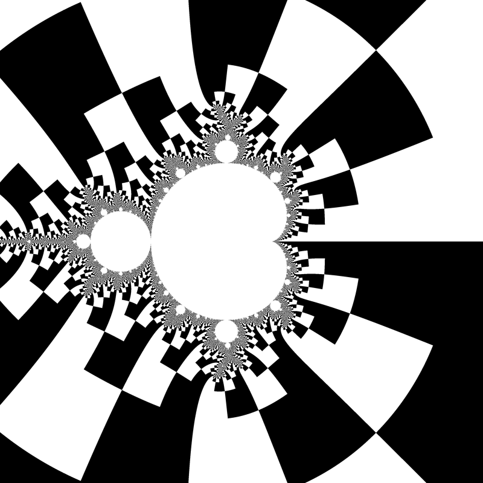

Colour according to the sign of Im(z) (the first escaped iterate). Increasing escape radius is necessary to align edges between layers. Escape radius around ER = 25  makes the decomposed cells roughly square.


[C99 Code](./src/binary-decomposition.c)

color of the pixel depends on:
* the sign of the imaginary part of final z ( cimag(z) )
* position of final z with repect to the horizontal axis ( x-axis)

```c
img[j * w + i] = (k < kMax && cimag(z) < 0) ? 0 : 255; 
```

External rays of angles (measured in turns) $angle = \frac{k}{2^n}  \text{mod 1}$ can be seen as borders of cells. 


### Field lines

[Algorithm by hobold](https://fractalforums.org/fractal-mathematics-and-new-theories/28/plotting-field-lines-during-iteration/4233/new#new) 
* Let's remove the iteration bands and change the relative sizes of black and white checkerboard areas.
* The patterns (lines) were done by looking at the final value of the iterated Z_n, just after it escapes. The usual checkerboarded "binary decomposition" looks at just the sign of the imaginary part. But you really can choose any axis through the origin and color based on what side of the axis you end up on. Or you can choose a sector smaller than 180 degrees like I did: return (fabs(z.x)*0.1 < fabs(z.y));
* The bailout radius needs to be reasonably large for those field lines to align nicely between iteration bands. Because this analogy with field lines is only strictly true for an infinite bailout. So with a minimal bailout radius of 2.0, the binary decomposition ends up being very visibly distorted and misaligned.


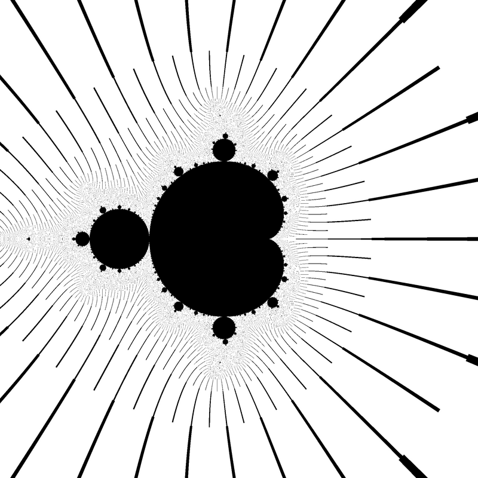

[C99 Code](./src/field-lines.c)


color of the pixel depends on the position of final z 
```c
img[j * w + i] = (k < kMax && fabs(creal(z))*0.1 < fabs(cimag(z))) ? 255 : 0;
```
The image shows lines that aproximate external rays of angles (measured in turns) $angle = \frac{k}{2^n}  \text{mod 1}$

### Continuous Dwell

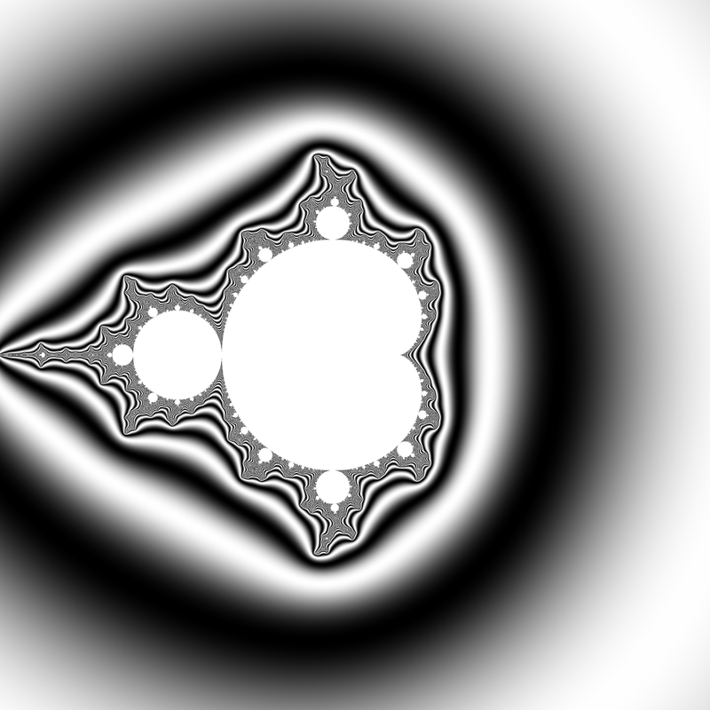

[Linas Vepstas](http://linas.org/art-gallery/escape/escape.html)  derives the renormalized continuous escape time:
```
mu = n + 1 - log(log (|z|))/log(2)
```
> In the above formula, the value of mu is almost completely independent of
> the iteration count, and of the escape radius, despite the fact that the
> right-hand-side of the equation is explicitly dependent on both of these
> quantities. The renormalized iteration count mu depends only on c,
> and is a piecewise-continuous, differentiable function thereof. By using
> a different analysis, it can be seen that the renormalized iteration count
> mu is in fact the residue remaining when a pole (due to the infinite
> sum) is removed. That is, the value of mu closely approximates the
> result of having iterated to infinity, that is, of having an infinite
> escape radius, and an infinite maximum iteration count.

C99 Code

```c
#include <complex.h>
#include <math.h>

double m_continuous_dwell(int N, double R, double _Complex c)
{
  double _Complex z = 0;
  for (int n = 0; n < N; ++n)
  {
    if (cabs(z) > R)
      return n + 1 - log2(log(cabs(z)));
    z = z * z + c;
  }
  return -1;
}
```


### Final angle


colour function uses both sources of information now: 
* hue coming from the escape time
* value from the final angle

With the escape radius at 512, the cells look almost square, and there are no visible gltiches.


c99 code: [fa.c](./src/fa.c)
 
### Final radius

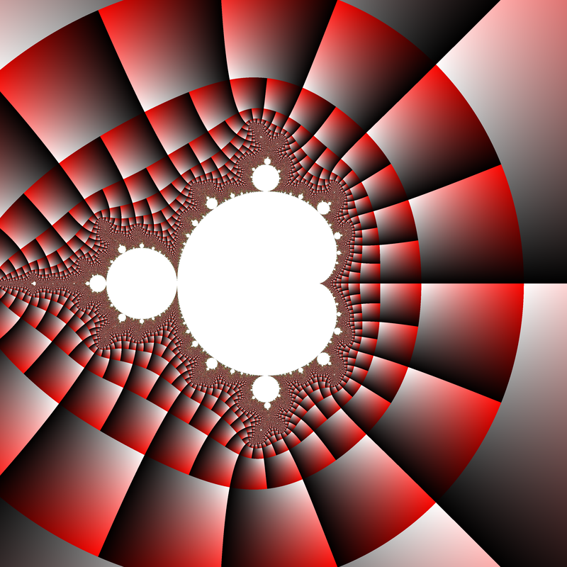


colour function uses both sources of information now: 
* hue coming from the escape time
* value from the final angle
* sat from final radius


c99 code: [fr.c](./src/fr.c)


### Smooth exterior


  


```c
if (n < nMax) // exterior 
      {
              
       /* the name final_z_abs is confusing indeed, sorry.
	
	It is the radial component of "exterior tiling" colouring, slightly different from Linas' renormalization.
	
	why denominator = 64.0 ? 

	arbitrary, chosen to make the colouring look ok.  try changing it as you like
	*/
       
        double final_z_abs = log(cabs(z)) / log(er) - 1.0;
        // double final_z_abs = cabs(z);
        int final_n = n;
        
        
        double continuous_escape_time = final_n - log2(final_z_abs + 1.0);
        hue = continuous_escape_time/64.0;
        sat = 0.7; 
        val = 1.0;
      }

```


c99 code: [s.c](./src/s.c)


### Grid 

grid showing:
* how the escape time bands get closer together towards the boundary of the Mandelbrot set
* how the angle cells double-up within each successive band


  


c99 code: [g.c](./src/g.c)  
```c
if (n < nMax) // exterior 
      {
       
        double final_z_abs = log(cabs(z)) / log(er) - 1.0;
        int final_n = n;
        double continuous_escape_time = final_n - log2(final_z_abs + 1.0);
        double  final_z_arg = fmod( carg(z)/TwoPi + 1.0, 1.0); 
        
        int grid = 
        	0.05 < final_z_abs &&
        	final_z_abs < 0.95 &&
        	0.05 < final_z_arg &&
        	final_z_arg < 0.95;
        
        
        //        
        hue = continuous_escape_time/64.0;
        sat = grid * 0.7; 
        val = 1.0;
      }
```


### improved grid 

The grid has noticeable step changes in the width of the rays heading towards the Mandelbrot
set, because each successive escape time band has double the number of cells, so at the boundary
between bands there is a discontinuity where the width halves. We can compensate for this by
making the rays wider (in local coordinate terms) further out and thinner further in. The inside
end should be twice as narrow as the outside end, to match up with the halving of the width
when crossing band boundaries. We keep the middle the same width as before by ensuring the
width factor is 1 there, which means the power should be 0 at the fractional radius 0.5. Now the
rays of the grid seem to continue along a smooth path towards the Mandelbrot set.


  


c99 code: [ig.c](./src/ig.c)  
```c
if (n < nMax) // exterior 
      {
       
        double final_z_abs = log(cabs(z)) / log(er) - 1.0;
        int final_n = n;
        double continuous_escape_time = final_n - log2(final_z_abs + 1.0);
        double  final_z_arg = fmod( carg(z)/TwoPi + 1.0, 1.0); 
        
        // improved grid
        double k = pow ( 0.5 , 0.5 - final_z_abs ) ;
	double grid_weight = 0.05 ;
        int grid = 
        	grid_weight < final_z_abs &&
        	final_z_abs < 1.0 - grid_weight &&
        	grid_weight * k < final_z_arg && 
        	final_z_arg < 1.0 - grid_weight * k;
        
        
        //        
        hue = continuous_escape_time/64.0;
        sat = grid * 0.7; 
        val = 1.0;
      }
```


### noise 


In the book it is : 1.31 Distance estimation.  

Our images look noisy and grainy near the boundary of the Mandelbrot set. The escape time bands get closer and closer, while the pixel spacing is fixed. The pixel grid samples isolated points of a mathematically abstract image defined on the continuous plane. [The Nyquist-Shannon sampling theorem](https://en.wikipedia.org/wiki/Nyquist%E2%80%93Shannon_sampling_theorem) shows that sampling isolated points from a continuum is a valid approximation only so long as the values don’t change too quickly between the points. Aliasing occurs when
the values do change too quickly compared to the sampling rate, with the grainy noisy visual effects as we have seen. Because the escape time bands increase in number without bound as we
approach the boundary of the Mandelbrot set, no sampling rate can be high enough.  


We know the escape time bands get closer together, and we know this causes problems related to the pixel spacing. So, multiplying the derivative by the pixel spacing is a first step (the pixel spacing is in fact the derivative with respect to our image device coordinates). We
know the problems occur when the bands are closer, meaning the variation is more rapid, so we divide something by this product. What we divide by will remain somewhat magical for now,
involving the final z iterate, but our final result is a distance estimate for the Mandelbrot set scaled to image device coordinates.  


The distance estimate has the useful property (proved in [the Koebe 1/4 theorem](https://en.wikipedia.org/wiki/Koebe_quarter_theorem)) that it tells us roughly how far our point is from the boundary of the Mandelbrot set. We can use it to:
* mask the grainy noise from aliasing
* highlighting the intricate shape of the boundary of the Mandelbrot set with all its filaments and shrunken copies. It is the pleasing side-effect.  

To contrast with the dark boundary, we fill the interior with white  

  


c99 code: [n.c](./src/n.c)  


### gray grid 

In the book it is : 1.32 Removing distracting colour.  

The bold colours are now a distraction: they don’t show us anything we can’t see from the grid or the distance estimation. Desaturating the image and making the exterior grid a light grey gives us a clean style that is easy on the eyes.

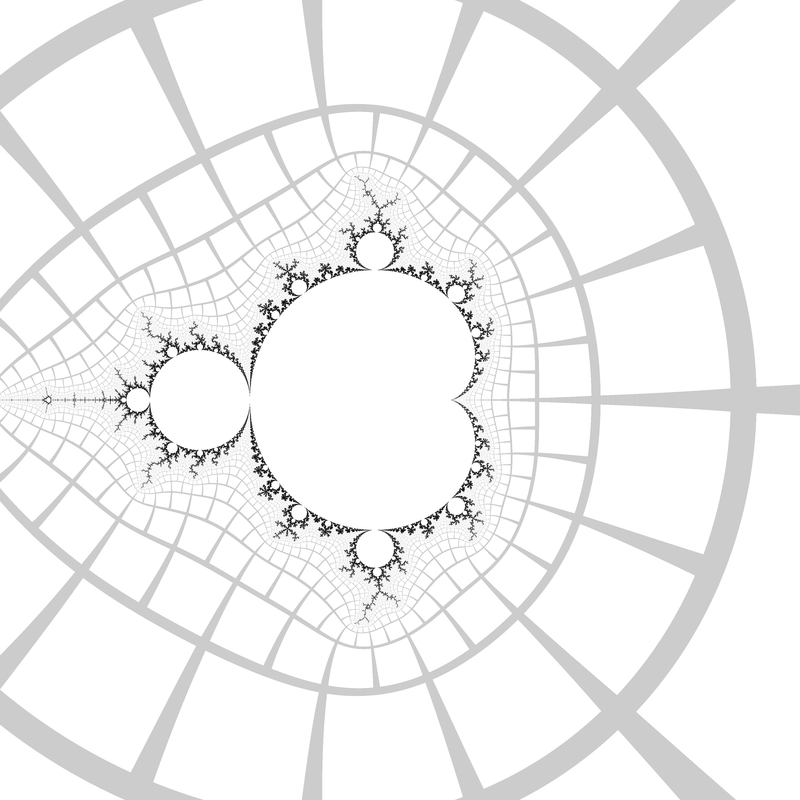  


c99 code: [gg.c](./src/gg.c)  


### Exterior Coordinates

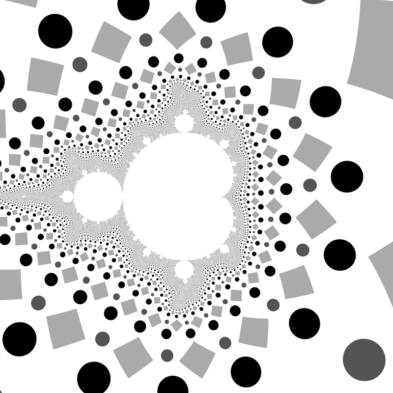

Escape radius around R = 25^2 makes the exterior grid cells roughly square.
The imaginary part of e is linearized to avoid shape distortion.
```
Re(e) = (arg(z)/2pi) mod 1 
Im(e) = 2 - log(z) / log R
```
The exterior coordinate $e$ can be used to look up pixel colours from an
image texture, but care must be taken to avoid glitches at the cell boundaries
if automatic derivatives are used for mipmapped anti-aliasing.  The calculation
of the derivatives must be modified to account for the wrapped space.

[dancing angels](https://mathr.co.uk/blog/2012-12-25_dancing_angels.html) has an example of animating image texture during a zoom video.

[C99 Code](./src/exterior-coordinates.c)

```c
#include <complex.h>
#include <math.h>

const double pi = 3.141592653589793;

double _Complex m_exterior_coordinates(int N, double R, double _Complex c)
{
  double _Complex z = 0;
  for (int n = 0; n < N; ++n)
  {
    if (cabs(z) > R)
      return fmod(1 + carg(z) / (2 * pi), 1) + I * (2 - log(cabs(z)) / log(R));
    z = z * z + c;
  }
  return 0;
}
```


### Dwell Gradient


```
v = (mu - mu_x, mu - mu_y, s)
g = v3 / |v|
```

where mu_x and mu_y are the continuous dwells of neighbouring pixels to
the above and left of the pixel under consideration, and $s > 0$ is a parameter
that controls the strength of the effect. 
```
0 <= g <= 1 
```
colours the boundary of the set where iteration count goes up increasingly quickly. 
Define mu to be large and negative for pixels that didn't escape.

[Fake DE](https://mathr.co.uk/blog/2014-12-13_faking_distance_estimate_colouring.html) also describes using 
```
tan^{-1} v_2/v_1 
```

as hue for a rainbow colouring of dwell slope.

[C99 Code ](./src/dwell-gradient.c)

```c
#include <complex.h>
#include <math.h>

const double pi = 3.141592653589793;

double _Complex m_dwell_gradient(int N, double R, double s, double d, double _Complex c)
{

  double m  = m_continuous_dwell(N, R, c);
  double mx = m_continuous_dwell(N, R, c + d);
  double my = m_continuous_dwell(N, R, c + d * I);
  double vx = m - mx;
  double vy = m - my;
  double vz = s;
  double vm = sqrt(vx * vx + vy * vy + vz * vz);
  return vz / vm;
}
```

### Exterior Distance

DEM/M = Distance Estimation Method for Mandelbrot set

Given c outside the Mandelbrot set, the exterior distance estimate satisfies by 


```
d = 2*abs(z)*log|z|/|dz|  
```

where dz is [first derivative of zn with respect to c](https://en.wikibooks.org/wiki/Fractals/Iterations_in_the_complex_plane/demm)   


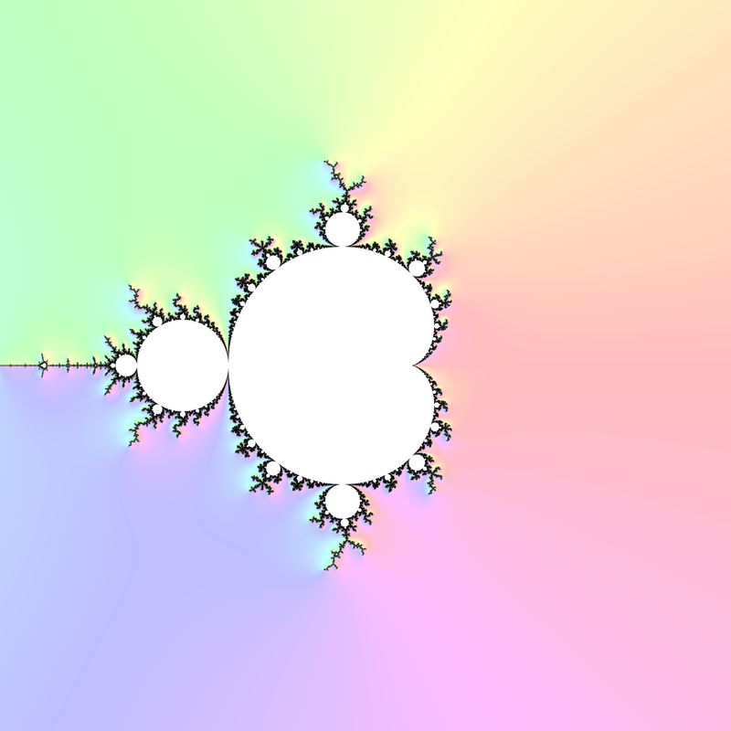

Formalizes the dwell gradient idea, in that closeness of dwell bands is related to closeness to the boundary of the set.  


the Koebe $\frac{1}{4}$ Theorem:
* No point in the Mandelbrot set is within d/4
* There is a point in the Mandelbrot set within 4 d  

Compare with pixel spacing to know if the Mandelbrot set might intersect a pixel.  

Colouring (shading) using $t = \tanh \frac{d}{\text{pixel size}}$ works well because $t \in [0,1)$ and $\tanh 4 \approx 1$.  

A complex-valued distance estimate (with directional information) can be calculated by:

```
d = 2*z*log|z|/dz
```


[Distance estimation](https://mathr.co.uk/blog/2010-10-30_distance_estimation.html)  and [Circular wavefronts](https://mathr.co.uk/blog/2010-11-02_circular_wavefronts.html) use distance estimates to give progressively
finer approximations to the exterior, while [adaptive super sampling](https://mathr.co.uk/blog/2014-11-22_adaptive_supersampling_using_distance_estimate.html) describes an
adaptive supersampling method.

C99 Code

```c
#include <complex.h>
#include <math.h>

const double pi = 3.141592653589793;

double _Complex m_exterior_distance(int N, double R, double _Complex c)
{
  double _Complex z = 0;
  double _Complex dc = 0;
  for (int n = 0; n < N; ++n)
  {
    if (cabs(z) > R)
      return 2 * z * log(cabs(z)) / dc;
    dc = 2 * z * dc + 1;
    z = z * z + c;
  }
  return -1;
}
```

Code
* [exterior-distance.c](./src/exterior-distance.c)


### Atom domains

Parameter Plain ( Mandelbrot) Atom Domains

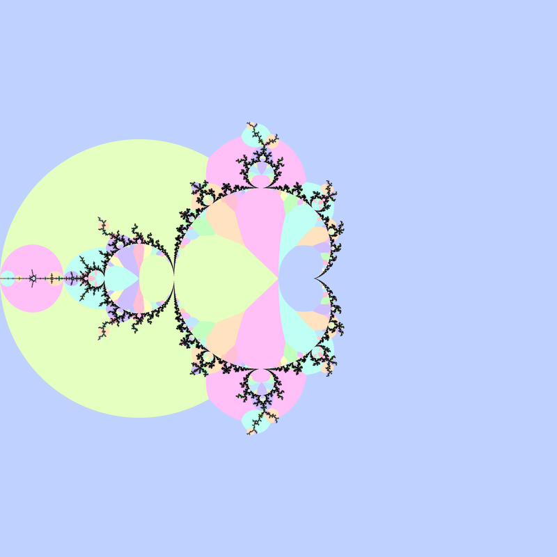

Atom domains in the Mandelbrot set are defined as the index $p \ge 1$ at which
$\left|z_p\right|$ is minimized during iteration of $z_0 = 0$ and
$z_{n+1} = z_n^2 + c$. Atom domains surround hyperbolic components of the same
period, and are generally much larger than the components themselves, which
makes them useful for finding components.


C99 Code : [atom-domains.c](./src/atom-domains.c)

```c
#include <complex.h>
#include <math.h>

int m_atom_domains(int N, double R, double _Complex c)
{
  double _Complex z = c;
  double mp = 1.0 / 0.0;
  int p = 0;
  for (int n = 1; n < N; ++n)
  {
    double zp = cabs(z);
    if (zp < mp)
    {
      mp = zp;
      p = n;
    }
    z = z * z + c;
  }
  return p;
}
```

see also : 
* [gif and code at commons](https://commons.wikimedia.org/wiki/File:Mandelbrot_Atom_Domains_Animation.gif)  
* [wikibooks](https://en.wikibooks.org/wiki/Fractals/Iterations_in_the_complex_plane/atomdomains)
* @CHAModified describes a [modification of atom domains](https://mathr.co.uk/blog/2012-12-25_modified_atom_domains.html), which makes smaller domains more visible
* [filtered_atom_domains](http://mathr.co.uk/blog/2017-05-22_filtered_atom_domains.html)

   
   


One can apply atom domain algorithm only to the exterior and add grid:   

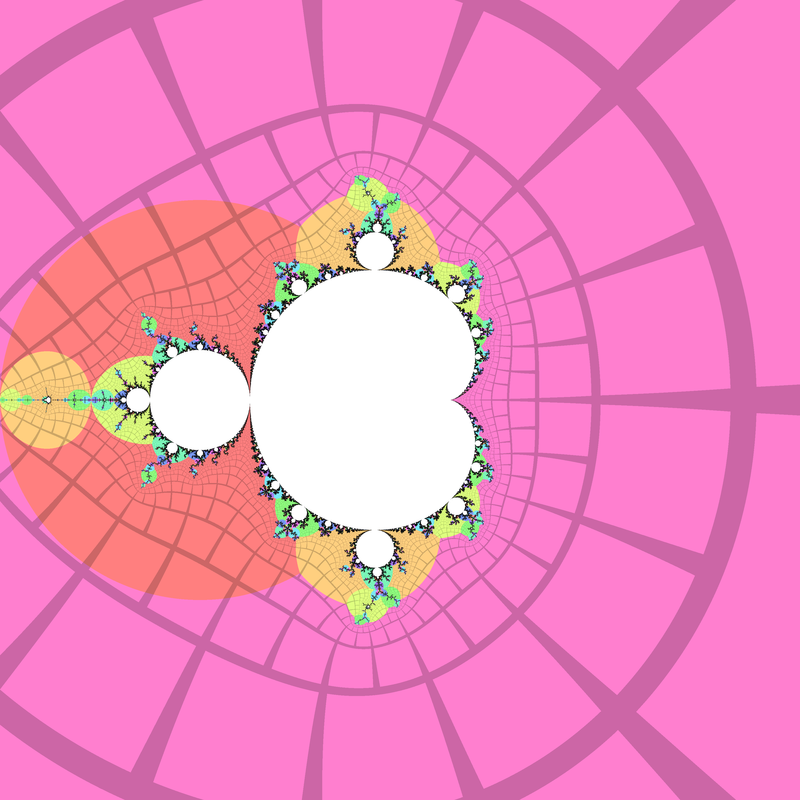  

C99 Code : [ad2.c](./src/ad2.c)  


### Misiurewicz Domains

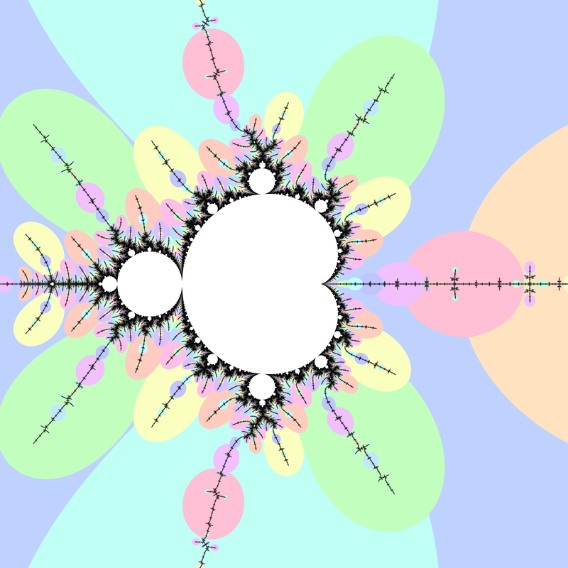

Preperiodic points in the Mandelbrot set are called Misiurewicz points, and
they have repelling orbits (periodic hyperbolic components have attracting
orbits). Atom domains show the period with the preperiod fixed at $0$, while
for Misiurewicz domains show the preperiod with the period fixed.

[MisiurewiczDomains](https://mathr.co.uk/blog/2015-01-26_newtons_method_for_misiurewicz_points.html)
defines the Misiurewicz domain for period $p \ge 1$ as the index $q$ at which
$\left|z_{p + q} - z_q\right|$ is minimized.  Misiurewicz domains surround
Misiurewicz points whose period divides $p$, and are much larger than a single
point, which makes makes them useful for finding Misiurewicz points.

C99 Code

```c
#include <complex.h>

int m_misiurewicz_domains(int N, int p, double _Complex c)
{
  int q = 0;
  double _Complex z = c;
  double _Complex zp = c;
  double mq = 1.0 / 0.0;
  for (int n = 0; n < p; ++n)
  {
    z = z * z + c;
  }
  for (int n = 0; n < N - p; ++n)
  {
    double zq = cabs(z - zp);
    if (zq < mq)
    {
      mq = zq;
      q = n;
    }
    z = z * z + c;
    zp = zp * zp + c;
  }
  return q;
}
```

### Interior Coordinates

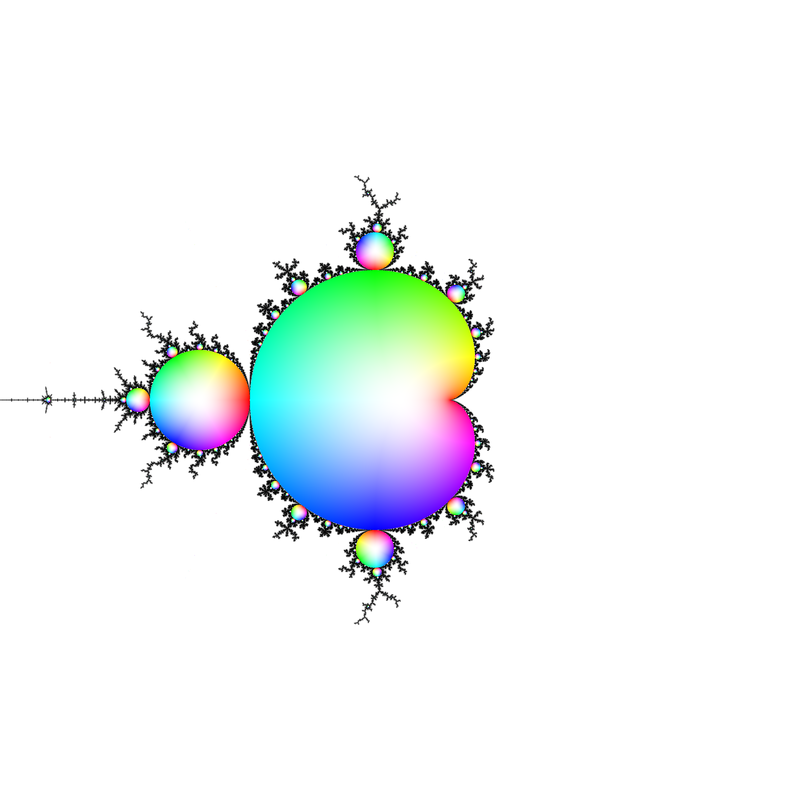

@CHAInteriorCoords derives an algorithm for calculating interior coordinates
$b$, and it turned out that only periods that are "partials" (corresponding to
atom domains) need be considered:

* For each period p, starting from 1 and increasing:
  * If |F^p(0, c)| reaches a new minimum:
    * Find z_0 such that F^p(z_0,c)=z_0 using Newton's method in one complex variable (["attractor"](#attractor));
    * Find b =dF^p(z_0,c)/dz
    * If |b| <= 1 then return b, otherwise continue with the next p.

C99 Code

```c
#include <complex.h>

double _Complex m_interior_coordinates(int N, int M, double _Complex c)
{
  double _Complex z = 0;
  double mz = 1.0 / 0.0;
  for (int n = 0; n < N; ++n)
  {
    z = z * z + c;
    double zp = cabs(z);
    if (zp < mz)
    {
      mz = zp;
      double _Complex w = m_attractor(z, n, c, M);
      double _Complex dw = 1;
      for (int m = 0; m < n; ++m)
      {
        dw = 2 * w * dw;
        w = w * w + c;
      }
      if (cabs(dw) <= 1)
        return dw;
    }
  }
  return 0;
}
```

### Interior Distance

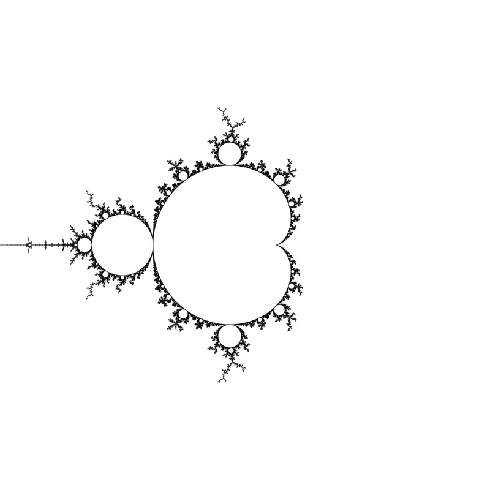

The formula for interior distance estimation is:

$d = \frac{1-\left|\frac{\partial}{\partial{z}}\right|^2}{\left|\frac{\partial}{\partial{c}}\frac{\partial}{\partial{z}} + \frac{\left(\frac{\partial}{\partial{z}}\frac{\partial}{\partial{z}}\right) \left(\frac{\partial}{\partial{c}}\right)} {1-\frac{\partial}{\partial{z}}}\right|}$

where the derivatives are evaluated at $z_0$ satisfying $F^p(z_0, c) = z_0$.

Following page [Practical interior distance rendering](https://mathr.co.uk/blog/2014-11-02_practical_interior_distance_rendering.html), simple code for distance estimate rendering now
looks something as follows; more involved algorithms that provide a significant
speed-up can be found at the reference.

C99 Code

```c
#include <complex.h>
#include <math.h>

double cnorm(double _Complex z)
{
  return creal(z) * creal(z) + cimag(z) * cimag(z);
}

double m_interior_distance(double _Complex z0, double _Complex c, int p) {
  double _Complex z = z0;
  double _Complex dz = 1;
  double _Complex dzdz = 0;
  double _Complex dc = 0;
  double _Complex dcdz = 0;
  for (int m = 0; m < p; ++m)
  {
    dcdz = 2 * (z * dcdz + dz * dc);
    dc = 2 * z * dc + 1;
    dzdz = 2 * (dz * dz + z * dzdz);
    dz = 2 * z * dz;
    z = z * z + c;
  }
  return (1 - cnorm(dz)) / cabs(dcdz + dzdz * dc / (1 - dz));
}

double m_distance(int N, double R, double _Complex c)
{
  double _Complex dc = 0;
  double _Complex z = 0;
  double m = 1.0 / 0.0;
  int p = 0;
  for (int n = 1; n <= N; ++n)
  {
    dc = 2 * z * dc + 1;
    z = z * z + c;
    if (cabs(z) > R)
      return 2 * cabs(z) * log(cabs(z)) / cabs(dc);
    if (cabs(z) < m)
    {
      m = cabs(z);
      p = n;
      double _Complex z0 = m_attractor(z, c, p);
      double _Complex w = z0;
      double _Complex dw = 1;
      for (int k = 0; k < p; ++k)
      {
        dw = 2 * w * dw;
        w = w * w + c;
      }
      if (cabs(dw) <= 1)
        return m_interior_distance(z0, c, p);
    }
  }
  return 0;
}
```


### mu-atom mapping

[mu-atom mapping](https://mathr.co.uk/mandelbrot/mu-atom/): period p hyperbolic components of the Mandelbrot set can each be mapped conformally to the unit disc, by the derivative d/dz of the periodic limit cycle where f_c^p(z_0) = z_0.

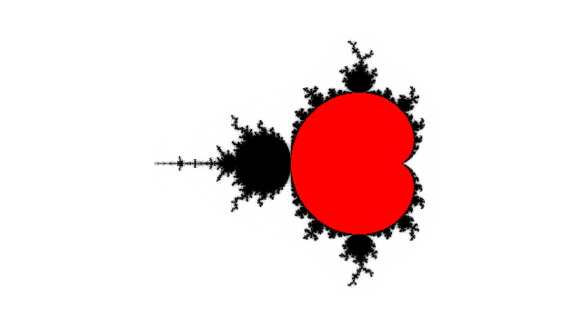  

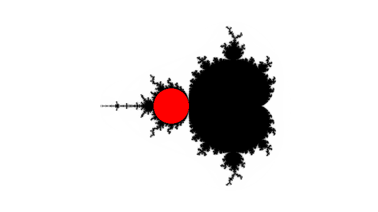  

  

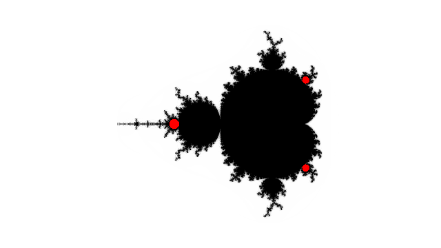  


Code
* [mu-atom.c](./src/mu-atom/mu-atom.c)
* [m.sh](./src/mu-atom/m.sh)
* [Makefile](./src/mu-atom/Makefile)

One can run:
* make ( to make 1-10 png files)
* ./a.out 1 > 1.ppm ( to make one file)


## Numerical Algorithms

### Period
* [periodicity scan](https://mathr.co.uk/blog/2017-05-17_periodicity_scan.html) - scanning parameter plane and finding period of each point c = period of each componnet. Here  [Robert P. Munafo's Jordan curve method](https://www.mrob.com/pub/muency/period.html) and Newton method is used 
* [c code:  box period ](./src/m-box-period.c)
* [original c code ](https://code.mathr.co.uk/mandelbrot-numerics/blob/HEAD:/c/bin/m-box-period.c)


### Nucleus

The nucleus $c$ of a hyperbolic component of period $p$ satisfies:

$F^p(0,c) = 0$

Applying Newton's method in one complex variable:

$c_{m+1} = c_m - \frac{F^p(0, c_m)}{\frac{\partial}{\partial c}F^p(0, c_m)}$

A reasonable starting guess $c_0$ for Newton's method is within [the atom domain of the component](https://mathr.co.uk/blog/2012-12-25_mandelbrot_set_newton_basins.html). 

C99 Code

```c
#include <complex.h>

double _Complex m_nucleus(double _Complex c0, int period, int mMax)
{
	double _Complex c = c0;
	for (int m = 0; m < mMax, ++m)
	{
		double _Complex z = 0;
		double _Complex dc = 0;
		for (int i = 0; i < period; ++i)
		{
			dc = 2 * z * dc + 1;
			z = z * z + c;
		}
		c = c - z / dc;
	}
	return c;
}
```

Examples

$c_0 = -1.8$, $p = 3$:

```
c_0 = -1.8 
c_1 = -1.75(78298397040690  
c_2 = -1.7548913878280483  
c_3 = -1.754877666(5449095 
c_4 = -1.7548776662466929
```

$c_0 = i$, $p = 4$:


```
c_0 = i 
c_1 = -0.11926605504587157    + 0.9357798165137615 i
c_2 = -0.23004008246918839    + 1.0769584254327267 i
c_3 = -0.18143326956347502    + 1.0265172581955131 i 
c_4 = -0.15552525333120717    + 1.0295018249244792 i 
c_5 = -0.15654521565515017    + 1.0322758207945100 i 
c_6 = -0.15652017318905109    + 1.0322471096777757 i 
c_7 = -0.15652016683375508    + 1.0322471089228316 i 
c_8 = -0.15652016683375505    + 1.0322471089228318 i 
c_9 = -0.15652016683375503    + 1.0322471089228318 i 
c_{10} = -0.15652016683375508 + 1.0322471089228318 i
```


Code
* [nucleus.c](./src/nucleus.c) - simple one function
* [m_d_nucleus.c](./src/m_d_nucleus.c) - complex function
* original file [m-nucleus.c](https://code.mathr.co.uk/mandelbrot-numerics/blob/HEAD:/c/bin/m-nucleus.c) which uses [m_d_nucleus.c](https://code.mathr.co.uk/mandelbrot-numerics/blob/HEAD:/c/lib/m_d_nucleus.c)


### Attractor

The attractor $w$ of a point $c$ within a hyperbolic component of period $p$ consists of $p$ points, each satisfying:

$F^p(w,c) = w$

Applying Newton's method in one complex variable:

$ w_{m+1} = w_m - \frac{F^p(w_m, c) - w_m}{\frac{\partial}{\partial z}F^p(w_m, c) - 1}$

A reasonable starting guess for Newton's method is $w_0 = F^p(0, c)$.

C99 Code

```c
#include <complex.h>

double _Complex m_attractor(double _Complex w0, double _Complex c, int p, int n)
{
	double _Complex w = w0;
	for (int m = 0; m < n; ++m)
	{
		double _Complex z = w;
		double _Complex dz = 1;
		for (int i = 0; i < p; ++i)
		{
			dz = 2 * z * dz;
			z = z * z + c;
		}
		w = w - (z - w) / (dz - 1);
	}
	return w;
}
```

Examples

$c = 0.5 i$, $p = 1$:

```
w_0 = & 0.5 i 
w_1 = -0.12500000000000000 + 0.37500000000000000i 
w_2 = -0.13602941176470587 + 0.39338235294117646 i
w_3 = -0.13600977572623132 + 0.39307572864807383 i
w_4 = -0.13600982475703358 + 0.39307568887870914 i
w_5 = -0.13600982475703449 + 0.39307568887871164 i
```

$c = -1.1 + 0.1 i$, $p = 2$:
```
w_0 = 0.1 - 0.12 i 
w_1 = 0.095782435714904968 - 0.084585559740811250 i 
w_2 = 0.097499098252211647 - 0.083677122424611575 i 
w_3 = 0.097497068763801931 - 0.083682418871189990 i 
w_4 = 0.097497068806210202 - 0.083682418894370822 i
```

### Interior Point

The interior point $b$ at internal angle $\theta$ measured in turns and internal radius $r \in [0,1]$ within a hyperbolic component of period $p$ satisfies:

$F^p(w,b) = w $
$\frac{\partial}{\partial z}F^p(w,b) = r e^{2 \pi i \theta} = t$


Applying Newton's method in two complex variables:


$\left(\begin{matrix}
\frac{\partial}{\partial z}F^p(w_m,b_m) - 1 &
\frac{\partial}{\partial c}F^p(w_m,b_m) \\
\frac{\partial}{\partial z}\frac{\partial}{\partial z}F^p(w_m,b_m) &
\frac{\partial}{\partial c}\frac{\partial}{\partial z}F^p(w_m,b_m)
\end{matrix}\right)\left(\begin{matrix}
w_{m+1} - w_m \\
b_{m+1} - b_m\end{matrix}\right) = -\left(\begin{matrix}
F^p(w_m,b_m) - w_m \\
\frac{\partial}{\partial z}F^p(w_m,b_m) - t
\end{matrix}\right)$


#### C99 Code

```c
#include <complex.h>

void m_interior_point
( double _Complex *z_out, double _Complex *c_out
, double _Complex z0, double _Complex c0
, double _Complex t, int p, int n
)
{
	double _Complex cc = c0;
	double _Complex zz = z0;
	for (int m = 0; m < n; ++m)
	{
		double _Complex c = cc;
		double _Complex z = zz;
		double _Complex dz = 1;
		double _Complex dc = 0;
		double _Complex dzdz = 0;
		double _Complex dcdz = 0;
		for (int i = 0; i < p; ++i)
		{
			dcdz = 2 * (z * dcdz + dc * dz);
			dzdz = 2 * (z * dzdz + dz * dz);
			dc = 2 * z * dc + 1;
			dz = 2 * z * dz;
			z = z * z + c;
  		}
		double _Complex det = (dz - 1) * dcdz - dc * dzdz;
		cc = cc - ((dz - 1) * (dz - t) - dzdz * (z - zz)) / det;
		zz = zz - (dcdz * (z - zz) - dc * (dz - t)) / det;
	}
	*z_out = zz;
	*c_out = cc;
}
```

Examples

$r = 1$, $\theta = \frac{1}{3}$, $p = 1$
```
w_0 = 0 b_0 = 0 
w_1 = -0.24999999999999989 + 0.43301270189221935 i b_1 = -0.24999999999999989 + 0.43301270189221935 i
w_2 = -0.24999999999999989 + 0.43301270189221935 i b_2 = -0.12499999999999978 + 0.64951905283832900 i
```

### Misiurewicz Point

@CHAPreBasins
@CHAMisiurewiczNewton

### Child Sizes

Child of a cardioid of size $s$ at internal angle $\frac{p}{q}$ has size
approximately:
$s' = \frac{s}{q^2} \sin\left(\pi \frac{p}{q}\right)$

Child of a circle of size $s$ at internal angle $\frac{p}{q}$ has size
approximately:
$s' = \frac{s}{q^2}$

### Size Estimate

@MSetENotes2013 presents a method to estimate the size of a hyperbolic component:

> Under iterations the critical orbit of period $p$ consecutively cycles through $p$ narrow intervals $S_1 \to S_2 \to \ldots \to S_1$ each of width $s_j$ (we choose $S_1$ to include the critical point $z = 0$).
> We expand $F^p(z, c)$ for small $z$ (in the narrow central interval $S_1$) and $c$ near its value $c_0$ at superstability of period-$p$ attracting orbit. 
> We see that the $s_j$ are small and the map in the intervals $S_2, S_3, \ldots S_n$ may be regarded as approximately linear; the full quadratic map must be retained for the central interval. 
> One thus obtains $z_{n+p} \approx L_p (z_n^2 + b (c - c_0))$ where $L_p = l_2 l_3 \ldots l_p$ is the product of the map slopes,  $l_n = 2 z_n$ in $p-1$ noncentral intervals and  $b = 1 + l_2^{-1} + (l_2 l_3)^{-1} + ... + L_n^{-1}$.
> We take $L_n$ at $c = c_0$ and treat it as a constant in narrow window. Introducing $Z = L_n z$ and $C = b L_n^2 (c - c_0)$ we get quadratic map  $Z_{n+p} = Z_n^2 + C$. Therefore the window width scales like $(b L_n^2)^{-1}$. 

C99 Code

```c
#include <complex.h>

double _Complex m_size_estimate(double _Complex c, int p)
{
	double _Complex b = 1;
	double _Complex l = 1;
	double _Complex z = 0;
	for (int i = 1; i < p; ++i)
	{
		z = z * z + c;
		l = 2 * z * l;
		b = b + 1 / l;
	}
	double _Complex s = 1 / (b * l * l);
	return s;
}
```

Examples

Cardioid $c = 0$, $p = 1$: $|s| = 1$

Circle $c = -1$, $p = 2$: $|s| = \frac{1}{2}$

Cardioid $c = -1.7548776662466927$, $p = 3$: $|s| = 0.019035515913132451$ 

Cardioid $c = -0.15652016683375508 + 1.0322471089228318 i$, $p = 4$: $|s| = 0.0084828587005172946 arg(s) = -0.61719885061563229$


### Shape Estimate

[Dolotin in paper "On the shapes of elementary domains or why Mandelbrot Set is made from almost ideal circles?" eq. 5.8](https://arxiv.org/abs/hep-th/0701234v1) derive a shape estimate $s$, with derivatives evaluated at $F^p(0,c)$ where $c$ is a nucleus of period $p$:

$s = - \frac{1}{\left(\frac{\partial}{\partial c}\right)\left(\frac{\partial}{\partial z}\right)} \left(\frac{\frac{\partial}{\partial c}\frac{\partial}{\partial c}} {2 \frac{\partial}{\partial c}} +\frac{\frac{\partial}{\partial c}\frac{\partial}{\partial z}}{  \frac{\partial}{\partial z}}\right)$


$s \approx 0$ corresponds to cardioid-like shapes.  
$s \approx 1$ corresponds to circle-like shapes.  


#### C99 Code

```c
#include <complex.h>
#include <stdbool.h>

double _Complex m_shape_estimate(double _Complex c, int p)
{
	double _Complex z = c;
	double _Complex dc = 1;
	double _Complex dz = 1;
	double _Complex dcdc = 0;
	double _Complex dcdz = 0;
	for (int i = 1; i < p; ++i)
	{
		dcdc = 2 * (z * dcdc + dc * dc);
		dcdz = 2 * (z * dcdz + dc * dz);
		dc = 2 * z * dc + 1;
		dz = 2 * z * dz;
		z = z * z + c;
	}
	double _Complex s = - (dcdc / (2 * dc) + dcdz / dz) / (dc * dz);
	return s;
}

bool m_shape_is_cardioid(double _Complex s)
{
	bool d = cabs(s) < cabs(s - 1);
	return d;
}
```

Examples

$c = -0.12256116687665361 + 0.74486176661974424 i$, $p = 3$:  
$s = 1.0212516030641008 + 0.047630153362811116 i \approx 1$

$c = -0.15652016683375508 + 1.0322471089228318 i$, $p = 4$:
$s = 0.058425597199448037 + 0.084498085298473649 i \approx 0$


Code
* [shape.c](./src/shape.c)
* [m-shape.c from numerics library](https://code.mathr.co.uk/mandelbrot-numerics/blob_plain/HEAD:/c/bin/m-shape.c)


### Domain Size

[atom domain size estimation page](https://mathr.co.uk/blog/2013-12-10_atom_domain_size_estimation.html) derives the atom domain size estimate for a nucleus $c$ of period $p$ as:

$r = \left|\frac{F^q(0, c)}{\frac{\partial}{\partial c} F^p(0, c)}\right|$

where $1 \le q < p$ minimizes $\left|F^q(0, c)\right|$.  The atom domain size is approximately 4 times the radius of circle-like components, and typically a lot larger for cardioid-like components.

C99 Code

```c
#include <complex.h>

double domain_size(double _Complex c, int p)
{
  double _Complex z = c;
  double _Complex dc = 1;
  double abszq = cabs(z);
  for (int_t q = 2; q <= p; ++q)
  {
    dc = 2 * z * dc + 1;
    z = z * z + c;
    double absz = cabs(z);
    if (absz < abszq && q < p)
      abszq = absz;
  }
  return abszq / cabs(dc);
}
```

Examples

Circle $c = -1$, $p = 2$:

$r = 1$

Cardioid $c = -1.7548776662466929$, $p = 3$:

$r = 0.23448676598793725$

### External Ray In

The next point $r$ along an external ray with current doubled angle $\theta$
measured in turns, current depth $p$ and current radius $R$ satisfies:

$F^p(0,r)=\lambda R e^{2 \pi i \theta}$
 
where $\lambda < 1$ controls the sharpness of the ray. Applying 
Newton's method in one complex variable:

$$r_{m+1} = r_m - \frac{F^p(0,r_m) - \lambda R e^{2 \pi i \theta}} {\frac{\partial}{\partial c}F^p(0,r_m)}$$

When crossing dwell bands, double $\theta$ and increment $p$, resetting
the radius $R$.  Stop tracing when close to the target (for example when
within the basin of attraction for Newton's method for nucleus).

C99 Code

```c
#include <complex.h>
#include <math.h>
#include <gmp.h>

struct m_exray_in {
	mpq_t angle;
	mpq_t one;
	int sharpness;
	double er;
	double _Complex c;
	int j;
	int k;
};

struct m_exray_in *m_exray_in_new(const mpq_t angle, int sharpness)
{
	m_d_exray_in *ray = malloc(sizeof(*ray));
	mpq_init(ray->angle);
	mpq_set(ray->angle, angle);
	mpq_init(ray->one);
	mpq_set_ui(ray->one, 1, 1);
	ray->sharpness = sharpness;
	ray->er = 65536.0;
	double a = twopi * mpq_get_d(ray->angle);
	ray->c = ray->er * cexp(I * a);
	ray->k = 0;
	ray->j = 0;
	return ray;
}

void m_exray_in_delete(struct m_exray_in *ray) {
	mpq_clear(ray->angle);
	mpq_clear(ray->one);
	free(ray);
}

double _Complex m_exray_in_step(struct m_exray_in *ray, int n)
{
	if (ray->j >= ray->sharpness)
	{
		mpq_mul_2exp(ray->angle, ray->angle, 1);
		if (mpq_cmp_ui(ray->angle, 1, 1) >= 0)
			mpq_sub(ray->angle, ray->angle, ray->one);
		ray->k = ray->k + 1;
		ray->j = 0;
	}
	double r = pow(ray->er, pow(0.5, (ray->j + 0.5) / ray->sharpness));
	double a = twopi * mpq_get_d(ray->angle);
	double _Complex target = r * cexp(I * a);
	double _Complex c = ray->c;
	for (int m = 0; m < n; ++m)
	{
		double _Complex z = 0;
		double _Complex dc = 0;
		for (int p = 0; p <= ray->k; ++p)
		{
			dc = 2 * z * dc + 1;
			z = z * z + c;
		}
		c = c - (z - target) / dc;
	}
	ray->j = ray->j + 1;
	ray->c = c;
	return c;
}
```

### External Ray Out

### External Angles

@CHAAutoAngles

## Symbolic Algorithms

### Tuning

Given a periodic external angle pair $(.\overline{a}, .\overline{b})$, tuning of an external angle $.c$ proceeds by replacing every $0$ in $c$ by $a$ and every $1$ by $b$.  
Here $a$, $b$, $c$ are blocks of binary digits (with $c$ possibly aperiodic and infinite in extent).

Haskell Code

~~~~ {.haskell}
type ExternalAngle = ([Bool], [Bool])

tuning :: (ExternalAngle, ExternalAngle) -> ExternalAngle -> ExternalAngle
tuning (([], per0), ([], per1)) (pre, per)
  = (concatMap t pre, concatMap t per)
  where
    t False = per0
    t True  = per1
~~~~

Examples

The external angle pair of the period $3$ island is:
$\left(.\overline{011}, .\overline{100}\right)$

The lower angle of the period $2$ bulb is $.\overline{01}$, tuned by the period $3$ island becomes $.\overline{011100}$ which is the lower angle of the period $6$ bulb attached to the period $3$ cardioid at internal angle
$\frac{1}{2}$.

The external angle of the tip of the antenna is $.1 = .0\overline{1} = .1\overline{0}$, tuned by the period $3$ island becomes respectively $.011\overline{100}$ and $.100\overline{011}$, which are the external angles of the tip of the antenna of the period $3$ island.

### Primary Bulb

The child bulb of the period $1$ cardioid at internal angle $\frac{p}{q}$
has external angles:

$(.\overline{b_0 b_1 \ldots b_{q-3} 0 1}, .\overline{b_0 b_1 \ldots b_{q-3} 1 0})$

where

$b_0 b_1 \ldots = \operatorname{map} \left(\in \left(1 - \frac{p}{q}, 1\right)\right) \circ \operatorname{iterate} \left(+\frac{p}{q}\right) $ \frac{p}{q}$

Haskell Code

~~~~ {.haskell}
import Data.Fixed (mod')
import Data.List (genericTake)
import Data.Ratio (denominator)

type InternalAngle = Rational
type ExternalAngle = ([Bool], [Bool])

primaryBulb :: InternalAngle -> (ExternalAngle, ExternalAngle)
primaryBulb pq = (([], bs ++ [False, True]), ([], bs ++ [True, False]))
  where
    q = denominator pq
    bs
      = genericTake (q - 2)
      . map (\x -> 1 - pq < x && x < 1)
      . iterate (\x -> (x + pq) `mod'` 1)
      $ pq
~~~~

Examples

Consider the bulb at internal angle $\frac{p}{q} = \frac{2}{5}$:

$r_0 = \frac{2}{5} &\not\in \left(1 - \frac{2}{5},1\right) &\therefore b_0 = 0$
$r_1 = \frac{4}{5} &    \in \left(1 - \frac{2}{5},1\right) &\therefore b_1 = 1$
$r_2 = \frac{1}{5} &\not\in \left(1 - \frac{2}{5},1\right) &\therefore b_2 = 0$


Therefore the external angles for the $\frac{2}{5}$ bulb are:

$\left( .\overline{01001}, .\overline{01010} \right)$


### Lavaurs' Algorithm

@CHALavaurs
@CHAAbstractTree

### Primary Hub

### Primary Tips

### Spoke Navigation

@CHANavSpokes

### Islands in Hairs

@CHAPerPatterns
@CHAHairIslands

### Hair Navigation

@CHANavHairs

### Other Angles

@CHAMisiurewiczAngles

## Further Algorithms

### Perturbation

### Glitch Correction

@CHAGlitches

### Series Approximation

@CHASeriesApprox
@CHACodeGen


### Exponential Map

@CHAExpoMap
@CHAExpoMapKF

### Moebius Warp

@CHAStretching

### Julia Morphing

@CHATwoSpirals
@CHAAutoMorph
@CHAMorphSym

### Buddhabrot

@CHAAntiBuddha
@CHAVectorBuddha

### Spider Algorithm

@CHASpiders

## Bibliography

@article{Dolotin2008,
	author="V. {Dolotin} and A. {Morozov}",
	title="On the shapes of elementary domains or why Mandelbrot Set is made from almost ideal circles?",
	journal="International Journal of Modern Physics A",
	volume="Vol. 23, No. 22 (2008) 3613–3684",
	publisher="World Scientific Publishing Company",
	date="2008",
	url="https://arxiv.org/abs/hep-th/0701234v1"
}

@misc{Vepstas1997,
  author="Linas Vepstas",
  title="Renormalizing the Mandelbrot Escape",
  date="1997",
  url="http://linas.org/art-gallery/escape/escape.html"
}

@misc{MSetENotes2013,
  author="{MSet e-notes}",
  title="Windows of periodicity scaling",
  date="2013",
  url="http://ibiblio.org/e-notes/MSet/windows.htm"
}


@misc{CHANotebook,
  author="Claude Heiland-Allen",
  title="Mandelbrot notebook",
  date="2014-03-06",
  url="https://mathr.co.uk/blog/2014-03-06_mandelbrot_notebook.html"
}

@misc{CHADistance,
  author="Claude Heiland-Allen",
  title="Distance estimation",
  date="2010-10-30",
  url="https://mathr.co.uk/blog/2010-10-30_distance_estimation.html"
}

@misc{CHACircular,
  author="Claude Heiland-Allen",
  title="Circular wavefronts",
  date="2010-11-02",
  url="https://mathr.co.uk/blog/2010-11-02_circular_wavefronts.html"
}

@misc{CHALavaurs,
  author="Claude Heiland-Allen",
  title="Lavaurs' Algorithm",
  date="2010-11-13",
  url="https://mathr.co.uk/blog/2010-11-13_lavaurs_algorithm.html"
}

@misc{CHAAbstractTree,
  author="Claude Heiland-Allen",
  title="Abstract Mandelbrot tree",
  date="2010-11-24",
  url="https://mathr.co.uk/blog/2010-11-24_abstract_mandelbrot_tree.html"
}

@misc{CHAExpoMap,
  author="Claude Heiland-Allen",
  title="Exponential mapping and {OpenMP}",
  date="2010-12-06",
  url="https://mathr.co.uk/blog/2010-12-06_exponential_mapping_and_openmp.html"
}

@misc{CHAModified,
  author="Claude Heiland-Allen",
  title="Modified Atom Domains",
  date="2012-12-25",
  url="https://mathr.co.uk/blog/2012-12-25_modified_atom_domains.html"
}

@misc{CHADancing,
  author="Claude Heiland-Allen",
  title="Dancing Angels",
  date="2012-12-25",
  url="https://mathr.co.uk/blog/2012-12-25_dancing_angels.html"
}

@misc{CHABasins,
  author="Claude Heiland-Allen",
  title="Mandelbrot set Newton basins",
  date="2012-12-25",
  url="https://mathr.co.uk/blog/2012-12-25_mandelbrot_set_newton_basins.html"
}

@misc{CHAPreBasins,
  author="Claude Heiland-Allen",
  title="Preperiodic Mandelbrot set Newton basins",
  date="2013-01-29",
  url="https://mathr.co.uk/blog/2013-01-29_preperiodic_mandelbrot_set_newton_basins.html"
}

@misc{CHANavSpokes,
  author="Claude Heiland-Allen",
  title="Navigating by spokes in the Mandelbrot set",
  date="2013-02-01",
  url="https://mathr.co.uk/blog/2013-02-01_navigating_by_spokes_in_the_mandelbrot_set.html"
}

@misc{CHAInteriorCoords,
  author="Claude Heiland-Allen",
  title="Interior coordinates in the Mandelbrot set",
  date="2013-04-01",
  url="https://mathr.co.uk/blog/2013-04-01_interior_coordinates_in_the_mandelbrot_set.html"
}

@misc{CHAPerPatterns,
  author="Claude Heiland-Allen",
  title="Patterns of periods in the Mandelbrot set",
  date="2013-06-23",
  url="https://mathr.co.uk/blog/2013-06-23_patterns_of_periods_in_the_mandelbrot_set.html"
}

@misc{CHAHairIslands,
  author="Claude Heiland-Allen",
  title="Islands in the hairs",
  date="2013-10-02",
  url="https://mathr.co.uk/blog/2013-10-02_islands_in_the_hairs.html"
}

@misc{CHADomainSize,
  author="Claude Heiland-Allen",
  title="Atom domain size estimation",
  date="2013-12-10",
  url="https://mathr.co.uk/blog/2013-12-10_atom_domain_size_estimation.html"
}

@misc{CHAStretching,
  author="Claude Heiland-Allen",
  title="Stretching cusps",
  date="2013-12-16",
  url="https://mathr.co.uk/blog/2013-12-16_stretching_cusps.html"
}

@misc{CHAAntiBuddha,
  author="Claude Heiland-Allen",
  title="Ultimate Anti-Buddhabrot",
  date="2013-12-30",
  url="https://mathr.co.uk/blog/2013-12-30_ultimate_anti-buddhabrot.html"
}

@misc{CHANotebook,
  author="Claude Heiland-Allen",
  title="Mandelbrot Notebook",
  date="2014-03-06",
  url="https://mathr.co.uk/blog/2014-03-06_mandelbrot_notebook.html"
}

@misc{CHAGlitches,
  author="Claude Heiland-Allen",
  title="Perturbation glitches",
  date="2014-03-31",
  url="https://mathr.co.uk/blog/2014-03-31_perturbation_glitches.html"
}

@misc{CHASpiders,
  author="Claude Heiland-Allen",
  title="Resurrecting Spiders",
  date="2014-10-30",
  url="https://mathr.co.uk/blog/2014-10-30_resurrecting_spiders.html"
}

@misc{CHAInteriorDE,
  author="Claude Heiland-Allen",
  title="Practical interior distance rendering",
  date="2014-11-02",
  url="https://mathr.co.uk/blog/2014-11-02_practical_interior_distance_rendering.html"
}

@misc{CHANavHairs,
  author="Claude Heiland-Allen",
  title="Navigating in the hairs",
  date="2014-11-18",
  url="https://mathr.co.uk/blog/2014-11-18_navigating_in_the_hairs.html"
}

@misc{CHAAdaptiveSS,
  author="Claude Heiland-Allen",
  title="Adaptive super-sampling using distance estimate",
  date="2014-11-22",
  url="https://mathr.co.uk/blog/2014-11-22_adaptive_supersampling_using_distance_estimate.html"
}

@misc{CHAFakeDE,
  author="Claude Heiland-Allen",
  title="Faking distance estimate colouring",
  date="2014-12-13",
  url="https://mathr.co.uk/blog/2014-12-13_faking_distance_estimate_colouring.html"
}

@misc{CHAExpoMapKF,
  author="Claude Heiland-Allen",
  title="Exponential mapping with Kalles Fraktaler",
  date="2014-12-17",
  url="https://mathr.co.uk/blog/2014-12-17_exponential_mapping_with_kalles_fraktaler.html"
}

@misc{CHAAutoAngles,
  author="Claude Heiland-Allen",
  title="Automatically finding external angles",
  date="2014-12-20",
  url="https://mathr.co.uk/blog/2014-12-20_automatically_finding_external_angles.html"
}

@misc{CHAMisiurewiczAngles,
  author="Claude Heiland-Allen",
  title="External angles of Misiurewicz points",
  date="2015-01-15",
  url="https://mathr.co.uk/blog/2015-01-15_external_angles_of_misiurewicz_points.html"
}

@misc{CHAMisiurewiczNewton,
  author="Claude Heiland-Allen",
  title="Newton's method for Misiurewicz points",
  date="2015-01-26",
  url="https://mathr.co.uk/blog/2015-01-26_newtons_method_for_misiurewicz_points.html"
}

@misc{CHAMisiurewiczDomains,
  author="Claude Heiland-Allen",
  title="Misiurewicz domains",
  date="2015-02-01",
  url="https://mathr.co.uk/blog/2015-02-01_misiurewicz_domains.html"
}

@misc{CHATwoSpirals,
  author="Claude Heiland-Allen",
  title="Two spirals out...",
  date="2015-05-18",
  url="https://mathr.co.uk/blog/2015-05-18_two_spirals_out.html"
}

@misc{CHAAutoMorph,
  author="Claude Heiland-Allen",
  title="Automated Julia morphing",
  date="2016-02-25",
  url="https://mathr.co.uk/blog/2016-02-25_automated_julia_morphing.html"
}

@misc{CHACodeGen,
  author="Claude Heiland-Allen",
  title="Code generation for series approximation",
  date="2016-02-26",
  url="https://mathr.co.uk/blog/2016-02-26_code_generation_for_series_approximation.html"
}

@misc{CHAMorphSym,
  author="Claude Heiland-Allen",
  title="Julia morphing symmetry",
  date="2016-03-05",
  url="https://mathr.co.uk/blog/2016-03-05_julia_morphing_symmetry.html"
}


# ref
* [Fractal dimension of Julia sets by Claude Heiland-Allen 2016-05-16](https://mathr.co.uk/blog/2016-05-16_fractal_dimension_of_julia_sets.html)
* [PI in the Mandelbrot Set](https://mathr.co.uk/blog/2016-04-27_pi_in_the_mandelbrot_set.html)
* [Mandelbrot symbolics in the browser](https://mathr.co.uk/blog/2016-03-14_mandelbrot_symbolics_in_the_browser.html)
* [Simpler series approximation](https://mathr.co.uk/blog/2016-03-06_simpler_series_approximation.html)
* [Poincaré Zoom](https://mathr.co.uk/blog/2011-12-26_poincare_half-plane_metric_for_zoom_animation.html)
* [Zoom Interpolation](https://mathr.co.uk/blog/2010-08-31_optimizing_zoom_animations.html)
* [The Farey Tree: Finding parents in the Farey tree by Claude Heiland-Allen](https://mathr.co.uk/blog/2016-10-31_finding_parents_in_the_farey_tree.html)


# Git

create a new repository on the command line
```
git init
git add README.md
git commit -m "first commit"
git branch -M main
git remote add origin git@github.com:adammaj1/Mandelbrot-book-book.git
git push -u origin main
```


## Repo

Change:
* in general settings
  * add Social Preview Image ( Images should be at least 640×320px (1280×640px for best display))
* in repository details ( near About) add
  * description
  * website 
  * Topics (separate with spaces) 
  

Local repository

```
~/Mandelbrot-book-book
```


## Subdirectory

```git
mkdir png
git add *.png
git mv  *.png ./png
git commit -m "move"
git push -u origin main
```
then link the images:

```txt
 

```

to overwrite

```
git mv -f 
```

```
git mv ./src/*.c ./src/modified/bash/
git mv ./src/*.sh ./src/modified/bash/
gitt mv ./src/Makefile ./src/modified/bash/
```


## Github
* [GitHub Flavored Markdown Spec](https://github.github.com/gfm/)
* [md cheat sheet](http://mdcheatsheet.com/)
* [CommonMark Spec](https://spec.commonmark.org)
* [Markdown parser ](https://markdown-it.github.io/)


Math equation inside README.md
* $\sqrt{3x-1}+(1+x)^2$


