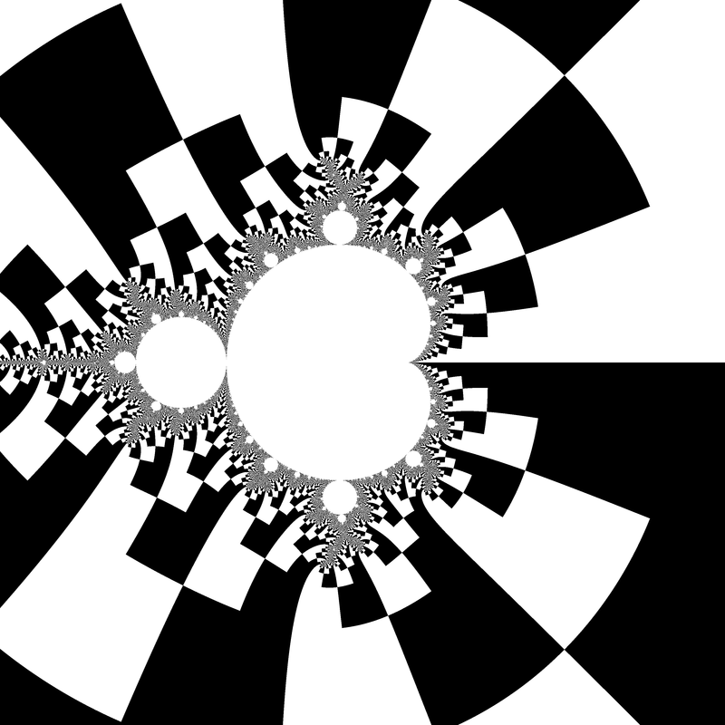
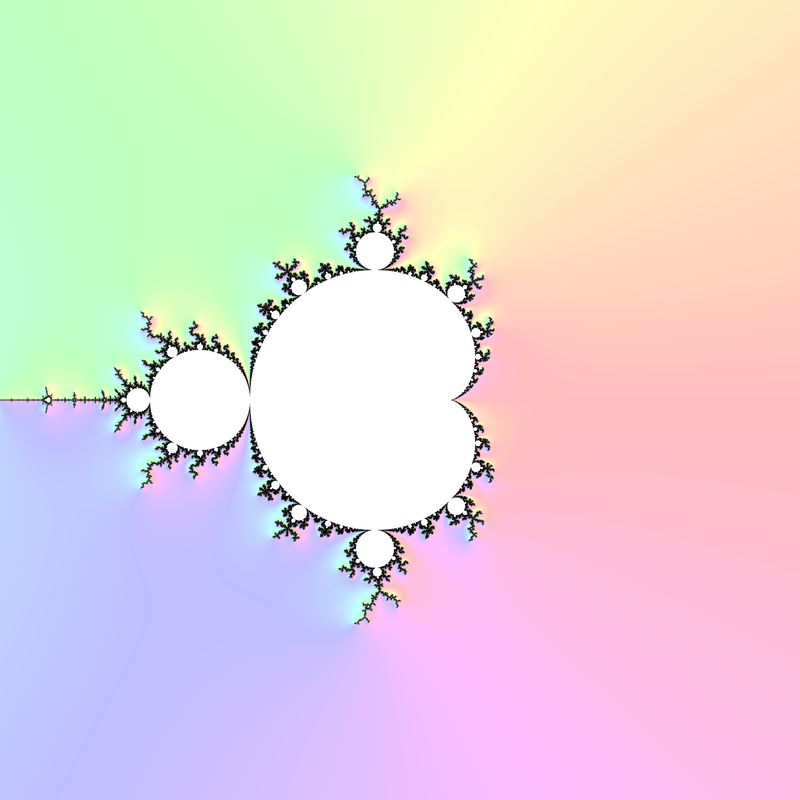
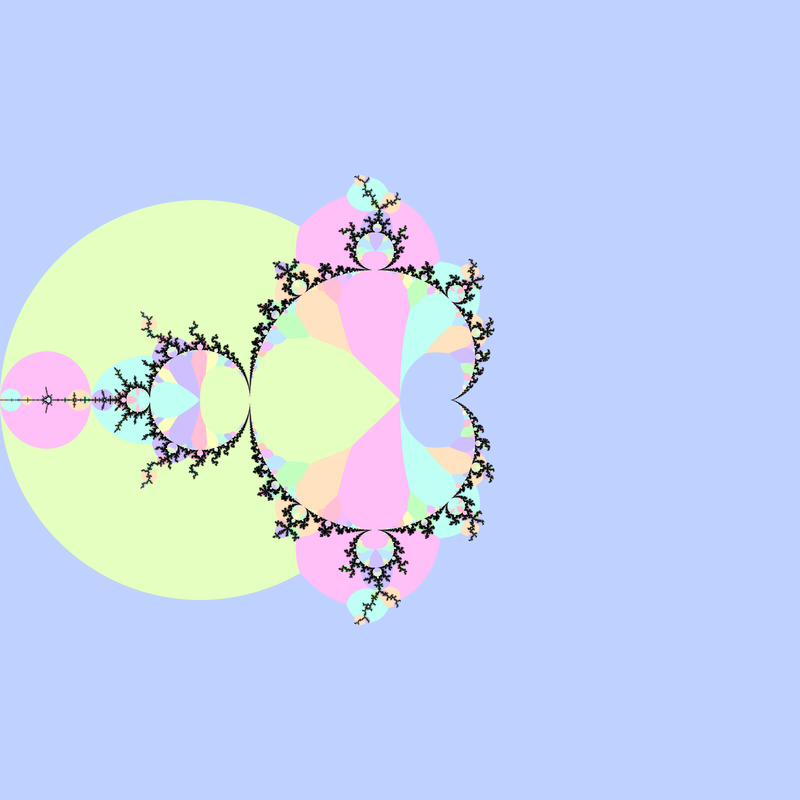
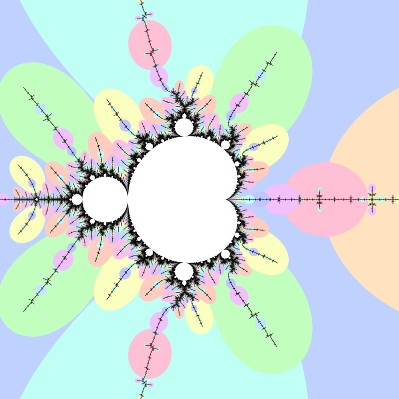
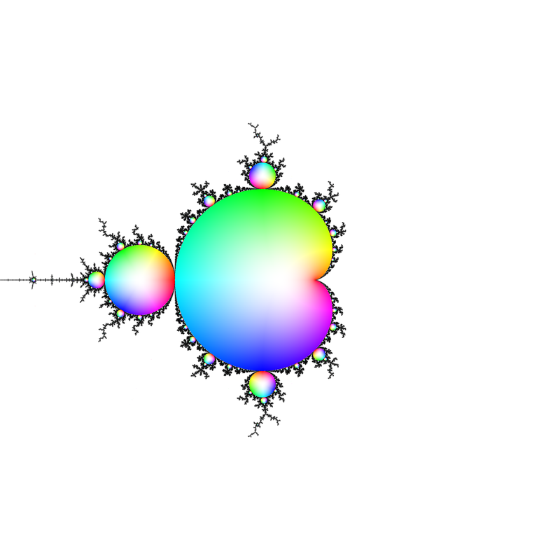
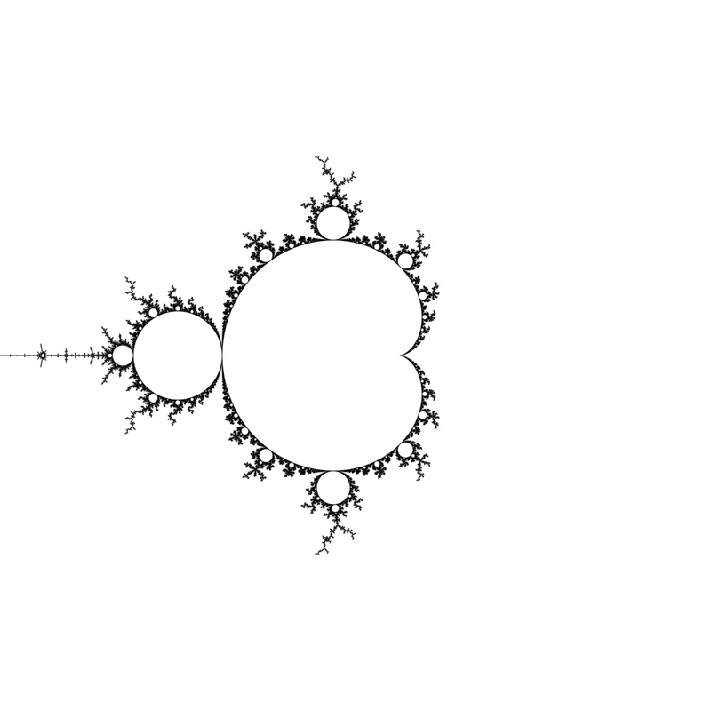

fork of [mandelbrot-book	how to write a book about the Mandelbrot set by Claude Heiland-Alle](
https://code.mathr.co.uk/mandelbrot-book/blob/HEAD:/book/book.md)

##Compare with
* [Examples c programs for drawing Mandelbrot set ](https://gitlab.com/adammajewski/mandelbrot_wiki_ACh) as described in [the wiki by A Cheritat](https://www.math.univ-toulouse.fr/~cheritat/wiki-draw/index.php/Mandelbrot_set)
* [mandelbrot-book: how to write a book about the Mandelbrot set by Claude Heiland-Allen ( full repository )](https://code.mathr.co.uk/mandelbrot-book)
* [clone of mandelbrot-book, use c files not diffs](https://gitlab.com/adammajewski/my-book) and [pdf file](https://gitlab.com/adammajewski/git-book-pdf)

##Programs
* in c99
* one file
* use 
  * OpenMP
  * complex numbers ( complex.h )
  * create pgm files


## converting images
Programs create pgm files. To convert to png use Image Magic from console:

````
  convert *.pgm -geometry 800x800 *.png
````

## Graphical Algorithms

### Membership


Colour according to whether the iterations diverge to infinity or not, within a
fixed maximum number of iterations $N$ and escape radius $R \ge 2$.  The
disconnected specks visible in the image turn out to be copies of the whole, and
despite appearances the Mandelbrot set is connected.

#### C99 Code

~~~~ {.c}
#include <complex.h>
#include <stdbool.h>

bool m_membership(int N, double R, double _Complex c)
{
  double _Complex z = 0;
  for (int n = 0; n < N; ++n)
  {
    if (cabs(z) > R)
      return false;
    z = z * z + c;
  }
  return true;
}
~~~~

### Escape Time


Colour according to the integer number of iterations $n$ at which
$$\left|z_n\right| > R \ge \left|z_{n-1}\right|$$
where escape radius $R \ge 2$.

#### C99 Code

~~~~ {.c}
#include <complex.h>

int m_escape_time(int N, double R, double _Complex c)
{
  double _Complex z = 0;
  for (int n = 0; n < N; ++n)
  {
    if (cabs(z) > R)
      return n;
    z = z * z + c;
  }
  return -1;
}
~~~~

### Binary Decomposition



Colour according to the sign of $\Im z$ (the first escaped iterate).
Increasing escape radius is
necessary to align edges between layers.  Escape radius around $R = 25$
makes the decomposed cells roughly square.

#### C99 Code

~~~~ {.c}
#include <complex.h>
#include <stdbool.h>

bool m_binary_decomposition(int N, double R, double _Complex c)
{
  double _Complex z = 0;
  for (int n = 0; n < N; ++n)
  {
    if (cabs(z) > R)
      return cimag(z) > 0;
    z = z * z + c;
  }
  return true;
}
~~~~

### Continuous Dwell


@Vepstas1997 derives the renormalized continuous escape time:

$$\mu = n + 1 - \log_2 \left( \log \left|z\right| \right)$$

> In the above formula, the value of $\mu$ is almost completely independent of
> the iteration count, and of the escape radius, despite the fact that the
> right-hand-side of the equation is explicitly dependent on both of these
> quantities. The renormalized iteration count $\mu$ depends only on $c$,
> and is a piecewise-continuous, differentiable function thereof. By using
> a different analysis, it can be seen that the renormalized iteration count
> $\mu$ is in fact the residue remaining when a pole (due to the infinite
> sum) is removed. That is, the value of $\mu$ closely approximates the
> result of having iterated to infinity, that is, of having an infinite
> escape radius, and an infinite maximum iteration count.

#### C99 Code

~~~~ {.c}
#include <complex.h>
#include <math.h>

double m_continuous_dwell(int N, double R, double _Complex c)
{
  double _Complex z = 0;
  for (int n = 0; n < N; ++n)
  {
    if (cabs(z) > R)
      return n + 1 - log2(log(cabs(z)));
    z = z * z + c;
  }
  return -1;
}
~~~~

### Exterior Coordinates


Escape radius around $R = 25^2$ makes the exterior grid cells roughly square.
The imaginary part of $e$ is linearized to avoid shape distortion.
$$\Re e = \frac{\arg z}{2 \pi} \mod 1 \\
\Im e = 2 - \frac{\log \left|z\right|}{\log R}$$

The exterior coordinate $e$ can be used to look up pixel colours from an
image texture, but care must be taken to avoid glitches at the cell boundaries
if automatic derivatives are used for mipmapped anti-aliasing.  The calculation
of the derivatives must be modified to account for the wrapped space.

@CHADancing has an example of animating image texture during a zoom video.

#### C99 Code

~~~~ {.c}
#include <complex.h>
#include <math.h>

const double pi = 3.141592653589793;

double _Complex m_exterior_coordinates(int N, double R, double _Complex c)
{
  double _Complex z = 0;
  for (int n = 0; n < N; ++n)
  {
    if (cabs(z) > R)
      return fmod(1 + carg(z) / (2 * pi), 1) + I * (2 - log(cabs(z)) / log(R));
    z = z * z + c;
  }
  return 0;
}
~~~~


### Dwell Gradient


$$\begin{aligned}
v &= \left(\begin{matrix}\mu - \mu_x \\ \mu - \mu_y \\ s\end{matrix}\right) \\
g &= \frac{v_3}{\left|v\right|}
\end{aligned}$$

where $\mu_x$ and $\mu_y$ are the continuous dwells of neighbouring pixels to
the above and left of the pixel under consideration, and $s > 0$ is a parameter
that controls the strength of the effect.  $0 \le g \le 1$ colours the boundary
of the set where iteration count goes up increasingly quickly.  Define $\mu$ to
be large and negative for pixels that didn't escape.

@CHAFakeDE also describes using $\tan^{-1} \frac{v_2}{v_1}$ as hue for a rainbow
colouring of dwell slope.

#### C99 Code

~~~~ {.c}
#include <complex.h>
#include <math.h>

const double pi = 3.141592653589793;

double _Complex m_dwell_gradient(int N, double R, double s, double d, double _Complex c)
{

  double m  = m_continuous_dwell(N, R, c);
  double mx = m_continuous_dwell(N, R, c + d);
  double my = m_continuous_dwell(N, R, c + d * I);
  double vx = m - mx;
  double vy = m - my;
  double vz = s;
  double vm = sqrt(vx * vx + vy * vy + vz * vz);
  return vz / vm;
}
~~~~

### Exterior Distance



Formalizes the dwell gradient idea, in that closeness of dwell bands is related
to closeness to the boundary of the set.

$$d = 2 \frac{\left|z\right| \log \left|z\right|}
{\left|\frac{\partial}{\partial c}\right|}$$

No point in the Mandelbrot set is within $\frac{d}{4}$.
There is a point in the Mandelbrot set within $4 d$ (FIXME check claim).
Compare with pixel spacing to know if the Mandelbrot set might intersect a
pixel.  Colouring using $\tanh$ works well, because $\tanh 4 \approx 1$

A complex-valued distance estimate (with directional information) can be
calculated by:

$$d = 2 \frac{z \log \left|z\right|}{\frac{\partial}{\partial c}}$$

@CHADistance and @CHACircular use distance estimates to give progressively
finer approximations to the exterior, while @CHAAdaptiveSS describes an
adaptive supersampling method.

#### C99 Code

~~~~ {.c}
#include <complex.h>
#include <math.h>

const double pi = 3.141592653589793;

double _Complex m_exterior_distance(int N, double R, double _Complex c)
{
  double _Complex z = 0;
  double _Complex dc = 0;
  for (int n = 0; n < N; ++n)
  {
    if (cabs(z) > R)
      return 2 * z * log(cabs(z)) / dc;
    dc = 2 * z * dc + 1;
    z = z * z + c;
  }
  return -1;
}
~~~~

### Atom Domains



Atom domains in the Mandelbrot set are defined as the index $p \ge 1$ at which
\left|z_p\right| is minimized during iteration of $z_0 = 0$ and
$z_{n+1} = z_n^2 + c$. Atom domains surround hyperbolic components of the same
period, and are generally much larger than the components themselves, which
makes them useful for finding components.

@CHAModified describes a modification of atom domains, which makes smaller
domains more visible.

#### C99 Code

~~~~ {.c}
#include <complex.h>
#include <math.h>

int m_atom_domains(int N, double R, double _Complex c)
{
  double _Complex z = c;
  double mp = 1.0 / 0.0;
  int p = 0;
  for (int n = 1; n < N; ++n)
  {
    double zp = cabs(z);
    if (zp < mp)
    {
      mp = zp;
      p = n;
    }
    z = z * z + c;
  }
  return p;
}
~~~~

### Misiurewicz Domains



Preperiodic points in the Mandelbrot set are called Misiurewicz points, and
they have repelling orbits (periodic hyperbolic components have attracting
orbits). Atom domains show the period with the preperiod fixed at $0$, while
for Misiurewicz domains show the preperiod with the period fixed.

@CHAMisiurewiczDomains
defines the Misiurewicz domain for period $p \ge 1$ as the index $q$ at which
$\left|z_{p + q} - z_q\right|$ is minimized.  Misiurewicz domains surround
Misiurewicz points whose period divides $p$, and are much larger than a single
point, which makes makes them useful for finding Misiurewicz points.

#### C99 Code

~~~~ {.c}
#include <complex.h>

int m_misiurewicz_domains(int N, int p, double _Complex c)
{
  int q = 0;
  double _Complex z = c;
  double _Complex zp = c;
  double mq = 1.0 / 0.0;
  for (int n = 0; n < p; ++n)
  {
    z = z * z + c;
  }
  for (int n = 0; n < N - p; ++n)
  {
    double zq = cabs(z - zp);
    if (zq < mq)
    {
      mq = zq;
      q = n;
    }
    z = z * z + c;
    zp = zp * zp + c;
  }
  return q;
}
~~~~

### Interior Coordinates



@CHAInteriorCoords derives an algorithm for calculating interior coordinates
$b$, and it turned out that only periods that are "partials" (corresponding to
atom domains) need be considered:

* For each period p, starting from 1 and increasing:
  * If $|F^p(0, c)|$ reaches a new minimum:
    * Find $z_0$ such that $F^p(z_0,c)=z_0$ using Newton's method in one complex variable (["attractor"](#attractor));
    * Find $b =\frac{\partial}{\partial z} F^p(z_0,c)$;
    * If $|b| \le 1$ then return $b$, otherwise continue with the next $p$.

#### C99 Code

~~~~ {.c}
#include <complex.h>

double _Complex m_interior_coordinates(int N, int M, double _Complex c)
{
  double _Complex z = 0;
  double mz = 1.0 / 0.0;
  for (int n = 0; n < N; ++n)
  {
    z = z * z + c;
    double zp = cabs(z);
    if (zp < mz)
    {
      mz = zp;
      double _Complex w = m_attractor(z, n, c, M);
      double _Complex dw = 1;
      for (int m = 0; m < n; ++m)
      {
        dw = 2 * w * dw;
        w = w * w + c;
      }
      if (cabs(dw) <= 1)
        return dw;
    }
  }
  return 0;
}
~~~~

### Interior Distance



The formula for interior distance estimation is:

$$d = \frac{1-\left|\frac{\partial}{\partial{z}}\right|^2}
{\left|\frac{\partial}{\partial{c}}\frac{\partial}{\partial{z}} +
\frac{\left(\frac{\partial}{\partial{z}}\frac{\partial}{\partial{z}}\right)
\left(\frac{\partial}{\partial{c}}\right)} {1-\frac{\partial}{\partial{z}}}\right|}$$

where the derivatives are evaluated at $z_0$ satisfying $F^p(z_0, c) = z_0$.

Following @CHAInteriorDE, simple code for distance estimate rendering now
looks something as follows; more involved algorithms that provide a significant
speed-up can be found at the reference.

#### C99 Code

~~~~ {.c}
#include <complex.h>
#include <math.h>

double cnorm(double _Complex z)
{
  return creal(z) * creal(z) + cimag(z) * cimag(z);
}

double m_interior_distance(double _Complex z0, double _Complex c, int p) {
  double _Complex z = z0;
  double _Complex dz = 1;
  double _Complex dzdz = 0;
  double _Complex dc = 0;
  double _Complex dcdz = 0;
  for (int m = 0; m < p; ++m)
  {
    dcdz = 2 * (z * dcdz + dz * dc);
    dc = 2 * z * dc + 1;
    dzdz = 2 * (dz * dz + z * dzdz);
    dz = 2 * z * dz;
    z = z * z + c;
  }
  return (1 - cnorm(dz)) / cabs(dcdz + dzdz * dc / (1 - dz));
}

double m_distance(int N, double R, double _Complex c)
{
  double _Complex dc = 0;
  double _Complex z = 0;
  double m = 1.0 / 0.0;
  int p = 0;
  for (int n = 1; n <= N; ++n)
  {
    dc = 2 * z * dc + 1;
    z = z * z + c;
    if (cabs(z) > R)
      return 2 * cabs(z) * log(cabs(z)) / cabs(dc);
    if (cabs(z) < m)
    {
      m = cabs(z);
      p = n;
      double _Complex z0 = m_attractor(z, c, p);
      double _Complex w = z0;
      double _Complex dw = 1;
      for (int k = 0; k < p; ++k)
      {
        dw = 2 * w * dw;
        w = w * w + c;
      }
      if (cabs(dw) <= 1)
        return m_interior_distance(z0, c, p);
    }
  }
  return 0;
}
~~~~

## Numerical Algorithms

### Nucleus

The nucleus $c$ of a hyperbolic component of period $p$ satisfies:

$$F^p(0,c) = 0$$

Applying Newton's method in one complex variable:

$$c_{m+1} = c_m - \frac{F^p(0, c_m)}{\frac{\partial}{\partial c}F^p(0, c_m)}$$

A reasonable starting guess for Newton's method is within the atom domain of
the component (@CHABasins).

#### C99 Code

~~~~ {.c}
#include <complex.h>

double _Complex m_nucleus(double _Complex c0, int p, int n)
{
	double _Complex c = c0;
	for (int m = 0; m < n, ++m)
	{
		double _Complex z = 0;
		double _Complex dc = 0;
		for (int i = 0; i < period; ++i)
		{
			dc = 2 * z * dc + 1;
			z = z * z + c;
		}
		c = c - z / dc;
	}
	return c;
}
~~~~

#### Examples

$c_0 = -1.8$, $p = 3$:
$$\begin{aligned}
c_0 &= -1.8 \\
c_1 &= -1.75(78298397040690\ldots) \\
c_2 &= -1.7548(913878280483\ldots) \\
c_3 &= -1.754877666(5449095\ldots) \\
c_4 &= -1.7548776662466929(\ldots)
\end{aligned}$$

$c_0 = i$, $p = 4$:
$$\begin{aligned}
c_0 &= & i \\
c_1 &= -0.(11926605504587157\ldots) &+ 0.(9357798165137615\ldots) i \\
c_2 &= -0.(23004008246918839\ldots) &+ 1.0(769584254327267\ldots) i \\
c_3 &= -0.1(8143326956347502\ldots) &+ 1.0(265172581955131\ldots) i \\
c_4 &= -0.15(552525333120717\ldots) &+ 1.0(295018249244792\ldots) i \\
c_5 &= -0.1565(4521565515017\ldots) &+ 1.0322(758207945100\ldots) i \\
c_6 &= -0.1565201(7318905109\ldots) &+ 1.03224710(96777757\ldots) i \\
c_7 &= -0.1565201668337550(8\ldots) &+ 1.032247108922831(6\ldots) i \\
c_8 &= -0.1565201668337550(5\ldots) &+ 1.0322471089228318(\ldots) i \\
c_9 &= -0.1565201668337550(3\ldots) &+ 1.0322471089228318(\ldots) i \\
c_{10} &= -0.15652016683375508(\ldots) &+ 1.0322471089228318(\ldots) i
\end{aligned}$$

### Attractor

The attractor $w$ of a point $c$ within a hyperbolic component
of period $p$ consists of $p$ points, each satisfying:

$$F^p(w,c) = w$$

Applying Newton's method in one complex variable:

$$ w_{m+1} = w_m - \frac{F^p(w_m, c) - w_m}
{\frac{\partial}{\partial z}F^p(w_m, c) - 1}$$

A reasonable starting guess for Newton's method is $w_0 = F^p(0, c)$.

#### C99 Code

~~~~ {.c}
#include <complex.h>

double _Complex m_attractor(double _Complex w0, double _Complex c, int p, int n)
{
	double _Complex w = w0;
	for (int m = 0; m < n; ++m)
	{
		double _Complex z = w;
		double _Complex dz = 1;
		for (int i = 0; i < p; ++i)
		{
			dz = 2 * z * dz;
			z = z * z + c;
		}
		w = w - (z - w) / (dz - 1);
	}
	return w;
}
~~~~

#### Examples

$c = 0.5 i$, $p = 1$:
$$\begin{aligned}
w_0 &= & 0.5 i \\
w_1 &= -0.1(2500000000000000\ldots) &+ 0.3(7500000000000000\ldots) i \\
w_2 &= -0.1360(2941176470587\ldots) &+ 0.393(38235294117646\ldots) i \\
w_3 &= -0.136009(77572623132\ldots) &+ 0.393075(72864807383\ldots) i \\
w_4 &= -0.13600982475703(358\ldots) &+ 0.3930756888787(0914\ldots) i \\
w_5 &= -0.13600982475703449(\ldots) &+ 0.39307568887871164(\ldots) i
\end{aligned}$$

$c = -1.1 + 0.1 i$, $p = 2$:
$$\begin{aligned}
w_0 &= 0.1 &- 0.12 i \\
w_1 &= 0.09(5782435714904968\ldots) &- 0.08(4585559740811250\ldots) i \\
w_2 &= 0.09749(9098252211647\ldots) &- 0.0836(77122424611575\ldots) i \\
w_3 &= 0.097497068(763801931\ldots) &- 0.0836824188(71189990\ldots) i \\
w_4 &= 0.097497068806210202(\ldots) &- 0.083682418894370822(\ldots) i
\end{aligned}$$

### Interior Point

The interior point $b$
at internal angle $\theta$ measured in turns and internal radius $r \in [0,1]$
within a hyperbolic component of period $p$
satisfies:

$$\begin{aligned}
F^p(w,b) &= w \\
\frac{\partial}{\partial z}F^p(w,b) &= r e^{2 \pi i \theta} = t
\end{aligned}$$

Applying Newton's method in two complex variables:

$$\left(\begin{matrix}
\frac{\partial}{\partial z}F^p(w_m,b_m) - 1 &
\frac{\partial}{\partial c}F^p(w_m,b_m) \\
\frac{\partial}{\partial z}\frac{\partial}{\partial z}F^p(w_m,b_m) &
\frac{\partial}{\partial c}\frac{\partial}{\partial z}F^p(w_m,b_m)
\end{matrix}\right)\left(\begin{matrix}
w_{m+1} - w_m \\
b_{m+1} - b_m\end{matrix}\right) = -\left(\begin{matrix}
F^p(w_m,b_m) - w_m \\
\frac{\partial}{\partial z}F^p(w_m,b_m) - t
\end{matrix}\right)$$

#### C99 Code

~~~~ {.c}
#include <complex.h>

void m_interior_point
( double _Complex *z_out, double _Complex *c_out
, double _Complex z0, double _Complex c0
, double _Complex t, int p, int n
)
{
	double _Complex cc = c0;
	double _Complex zz = z0;
	for (int m = 0; m < n; ++m)
	{
		double _Complex c = cc;
		double _Complex z = zz;
		double _Complex dz = 1;
		double _Complex dc = 0;
		double _Complex dzdz = 0;
		double _Complex dcdz = 0;
		for (int i = 0; i < p; ++i)
		{
			dcdz = 2 * (z * dcdz + dc * dz);
			dzdz = 2 * (z * dzdz + dz * dz);
			dc = 2 * z * dc + 1;
			dz = 2 * z * dz;
			z = z * z + c;
  		}
		double _Complex det = (dz - 1) * dcdz - dc * dzdz;
		cc = cc - ((dz - 1) * (dz - t) - dzdz * (z - zz)) / det;
		zz = zz - (dcdz * (z - zz) - dc * (dz - t)) / det;
	}
	*z_out = zz;
	*c_out = cc;
}
~~~~

#### Examples

$r = 1$, $\theta = \frac{1}{3}$, $p = 1$
$$\begin{aligned}
w_0 &= 0 \\
b_0 &= 0 \\
w_1 &= -0.24999999999999989 + 0.43301270189221935 i \\
b_1 &= -0.24999999999999989 + 0.43301270189221935 i \\
w_2 &= -0.24999999999999989 + 0.43301270189221935 i \\
b_2 &= -0.12499999999999978 + 0.64951905283832900 i
\end{aligned}$$

### Misiurewicz Point

@CHAPreBasins
@CHAMisiurewiczNewton

### Child Sizes

Child of a cardioid of size $s$ at internal angle $\frac{p}{q}$ has size
approximately:
$$s' = \frac{s}{q^2} \sin\left(\pi \frac{p}{q}\right)$$

Child of a circle of size $s$ at internal angle $\frac{p}{q}$ has size
approximately:
$$s' = \frac{s}{q^2}$$

### Size Estimate

@MSetENotes2013 presents a method to estimate the size of a hyperbolic component:

> Under iterations the critical orbit of period $p$ consecutively cycles
> through $p$ narrow intervals $S_1 \to S_2 \to \ldots \to S_1$ each of width
> $s_j$ (we choose $S_1$ to include the critical point $z = 0$).
> We expand $F^p(z, c)$ for small $z$ (in the narrow central interval $S_1$)
> and $c$ near its value $c_0$ at superstability of period-$p$ attracting
> orbit. We see that the $s_j$ are small and the map in the intervals
> $S_2, S_3, \ldots S_n$ may be regarded as approximately linear; the full
> quadratic map must be retained for the central interval. One thus obtains
> $$z_{n+p} \approx L_p (z_n^2 + b (c - c_0))$$
> where $L_p = l_2 l_3 \ldots l_p$ is the product of the map slopes,
> $l_n = 2 z_n$ in $p-1$ noncentral intervals and
> $b = 1 + l_2^{-1} + (l_2 l_3)^{-1} + ... + L_n^{-1}$.
> We take $L_n$ at $c = c_0$ and treat it as a constant in narrow window.
> Introducing $Z = L_n z$ and $C = b L_n^2 (c - c_0)$ we get quadratic map
> $Z_{n+p} = Z_n^2 + C$.
> Therefore the window width scales like $(b L_n^2)^{-1}$. 

#### C99 Code

~~~~ {.c}
#include <complex.h>

double _Complex m_size_estimate(double _Complex c, int p)
{
	double _Complex b = 1;
	double _Complex l = 1;
	double _Complex z = 0;
	for (int i = 1; i < p; ++i)
	{
		z = z * z + c;
		l = 2 * z * l;
		b = b + 1 / l;
	}
	double _Complex s = 1 / (b * l * l);
	return s;
}
~~~~

#### Examples

Cardioid $c = 0$, $p = 1$:
$$|s| = 1$$

Circle $c = -1$, $p = 2$:
$$|s| = \frac{1}{2}$$

Cardioid $c = -1.7548776662466927$, $p = 3$:
$$|s| = 0.019035515913132451$$ 

Cardioid $c = -0.15652016683375508 + 1.0322471089228318 i$, $p = 4$:
$$\begin{aligned}
|s| &= 0.0084828587005172946 \\
\arg s &= -0.61719885061563229
\end{aligned}$$

### Shape Estimate

@Dolotin2008 [eq. 5.8] derive a shape estimate $s$,
with derivatives evaluated at $F^p(0,c)$ where $c$ is a nucleus
of period $p$:

$$s = - \frac{1}{\left(\frac{\partial}{\partial c}\right)
                 \left(\frac{\partial}{\partial z}\right)}
        \left(\frac{\frac{\partial}{\partial c}\frac{\partial}{\partial c}}
                   {2 \frac{\partial}{\partial c}} +
              \frac{\frac{\partial}{\partial c}\frac{\partial}{\partial z}}
                   {  \frac{\partial}{\partial z}}\right)
$$

$s \approx 0$ corresponds to cardioid-like shapes.
$s \approx 1$ corresponds to circle-like shapes.

#### C99 Code

~~~~ {.c}
#include <complex.h>
#include <stdbool.h>

double _Complex m_shape_estimate(double _Complex c, int p)
{
	double _Complex z = c;
	double _Complex dc = 1;
	double _Complex dz = 1;
	double _Complex dcdc = 0;
	double _Complex dcdz = 0;
	for (int i = 1; i < p; ++i)
	{
		dcdc = 2 * (z * dcdc + dc * dc);
		dcdz = 2 * (z * dcdz + dc * dz);
		dc = 2 * z * dc + 1;
		dz = 2 * z * dz;
		z = z * z + c;
	}
	double _Complex s = - (dcdc / (2 * dc) + dcdz / dz) / (dc * dz);
	return s;
}

bool m_shape_is_cardioid(double _Complex s)
{
	bool d = cabs(s) < cabs(s - 1);
	return d;
}
~~~~

#### Examples

$c = -0.12256116687665361 + 0.74486176661974424 i$, $p = 3$:
$$s = 1.0212516030641008 + 0.047630153362811116 i \approx 1$$

$c = -0.15652016683375508 + 1.0322471089228318 i$, $p = 4$:
$$s = 0.058425597199448037 + 0.084498085298473649 i \approx 0$$

### Domain Size

@CHADomainSize derives the atom domain size estimate for a nucleus $c$ of
period $p$ as:

$$r = \left|\frac{F^q(0, c)}{\frac{\partial}{\partial c} F^p(0, c)}\right|$$

where $1 \le q < p$ minimizes $\left|F^q(0, c)\right|$.  The atom domain size
is approximately 4 times the radius of circle-like components, and typically a
lot larger for cardioid-like components.

#### C99 Code

~~~~ {.c}
#include <complex.h>

double domain_size(double _Complex c, int p)
{
  double _Complex z = c;
  double _Complex dc = 1;
  double abszq = cabs(z);
  for (int_t q = 2; q <= p; ++q)
  {
    dc = 2 * z * dc + 1;
    z = z * z + c;
    double absz = cabs(z);
    if (absz < abszq && q < p)
      abszq = absz;
  }
  return abszq / cabs(dc);
}
~~~~

#### Examples

Circle $c = -1$, $p = 2$:

$$r = 1$$

Cardioid $c = -1.7548776662466929$, $p = 3$:

$$r = 0.23448676598793725$$

### External Ray In

The next point $r$ along an external ray with current doubled angle $\theta$
measured in turns, current depth $p$ and current radius $R$ satisfies:

$$F^p(0,r)=\lambda R e^{2 \pi i \theta}$$
 
where $\lambda < 1$ controls the sharpness of the ray. Applying 
Newton's method in one complex variable:

$$r_{m+1} = r_m - \frac{F^p(0,r_m) - \lambda R e^{2 \pi i \theta}}
                       {\frac{\partial}{\partial c}F^p(0,r_m)}$$

When crossing dwell bands, double $\theta$ and increment $p$, resetting
the radius $R$.  Stop tracing when close to the target (for example when
within the basin of attraction for Newton's method for nucleus).

#### C99 Code

~~~~ {.c}
#include <complex.h>
#include <math.h>
#include <gmp.h>

struct m_exray_in {
	mpq_t angle;
	mpq_t one;
	int sharpness;
	double er;
	double _Complex c;
	int j;
	int k;
};

struct m_exray_in *m_exray_in_new(const mpq_t angle, int sharpness)
{
	m_d_exray_in *ray = malloc(sizeof(*ray));
	mpq_init(ray->angle);
	mpq_set(ray->angle, angle);
	mpq_init(ray->one);
	mpq_set_ui(ray->one, 1, 1);
	ray->sharpness = sharpness;
	ray->er = 65536.0;
	double a = twopi * mpq_get_d(ray->angle);
	ray->c = ray->er * cexp(I * a);
	ray->k = 0;
	ray->j = 0;
	return ray;
}

void m_exray_in_delete(struct m_exray_in *ray) {
	mpq_clear(ray->angle);
	mpq_clear(ray->one);
	free(ray);
}

double _Complex m_exray_in_step(struct m_exray_in *ray, int n)
{
	if (ray->j >= ray->sharpness)
	{
		mpq_mul_2exp(ray->angle, ray->angle, 1);
		if (mpq_cmp_ui(ray->angle, 1, 1) >= 0)
			mpq_sub(ray->angle, ray->angle, ray->one);
		ray->k = ray->k + 1;
		ray->j = 0;
	}
	double r = pow(ray->er, pow(0.5, (ray->j + 0.5) / ray->sharpness));
	double a = twopi * mpq_get_d(ray->angle);
	double _Complex target = r * cexp(I * a);
	double _Complex c = ray->c;
	for (int m = 0; m < n; ++m)
	{
		double _Complex z = 0;
		double _Complex dc = 0;
		for (int p = 0; p <= ray->k; ++p)
		{
			dc = 2 * z * dc + 1;
			z = z * z + c;
		}
		c = c - (z - target) / dc;
	}
	ray->j = ray->j + 1;
	ray->c = c;
	return c;
}
~~~~

### External Ray Out

### External Angles

@CHAAutoAngles

## Symbolic Algorithms

### Tuning

Given a periodic external angle pair $(.\overline{a}, .\overline{b})$,
tuning of an external angle $.c$ proceeds by replacing every $0$
in $c$ by $a$ and every $1$ by $b$.  Here $a$, $b$, $c$ are blocks of
binary digits (with $c$ possibly aperiodic and infinite in extent).

#### Haskell Code

~~~~ {.haskell}
type ExternalAngle = ([Bool], [Bool])

tuning :: (ExternalAngle, ExternalAngle) -> ExternalAngle -> ExternalAngle
tuning (([], per0), ([], per1)) (pre, per)
  = (concatMap t pre, concatMap t per)
  where
    t False = per0
    t True  = per1
~~~~

#### Examples

The external angle pair of the period $3$ island is:
$$\left(.\overline{011}, .\overline{100}\right)$$

The lower angle of the period $2$ bulb is $.\overline{01}$, tuned by the
period $3$ island becomes $.\overline{011100}$ which is the lower angle of
the period $6$ bulb attached to the period $3$ cardioid at internal angle
$\frac{1}{2}$.

The external angle of the tip of the antenna is
$.1 = .0\overline{1} = .1\overline{0}$, tuned by the period $3$ island
becomes respectively $.011\overline{100}$ and $.100\overline{011}$, which
are the external angles of the tip of the antenna of the period $3$ island.

### Primary Bulb

The child bulb of the period $1$ cardioid at internal angle $\frac{p}{q}$
has external angles:

$$(.\overline{b_0 b_1 \ldots b_{q-3} 0 1},
   .\overline{b_0 b_1 \ldots b_{q-3} 1 0})$$

where

$$b_0 b_1 \ldots = \operatorname{map} \left(\in \left(1 - \frac{p}{q}, 1\right)\right) \circ
  \operatorname{iterate} \left(+\frac{p}{q}\right) $ \frac{p}{q}$$

#### Haskell Code

~~~~ {.haskell}
import Data.Fixed (mod')
import Data.List (genericTake)
import Data.Ratio (denominator)

type InternalAngle = Rational
type ExternalAngle = ([Bool], [Bool])

primaryBulb :: InternalAngle -> (ExternalAngle, ExternalAngle)
primaryBulb pq = (([], bs ++ [False, True]), ([], bs ++ [True, False]))
  where
    q = denominator pq
    bs
      = genericTake (q - 2)
      . map (\x -> 1 - pq < x && x < 1)
      . iterate (\x -> (x + pq) `mod'` 1)
      $ pq
~~~~

#### Examples

Consider the bulb at internal angle $\frac{p}{q} = \frac{2}{5}$:

$$\begin{aligned}
r_0 = \frac{2}{5} &\not\in \left(1 - \frac{2}{5},1\right) &\therefore b_0 = 0 \\
r_1 = \frac{4}{5} &    \in \left(1 - \frac{2}{5},1\right) &\therefore b_1 = 1 \\
r_2 = \frac{1}{5} &\not\in \left(1 - \frac{2}{5},1\right) &\therefore b_2 = 0
\end{aligned}$$

Therefore the external angles for the $\frac{2}{5}$ bulb are:

$$\left( .\overline{01001}, .\overline{01010} \right)$$

### The Farey Tree

@CHAFarey

### Lavaurs' Algorithm

@CHALavaurs
@CHAAbstractTree

### Primary Hub

### Primary Tips

### Spoke Navigation

@CHANavSpokes

### Islands in Hairs

@CHAPerPatterns
@CHAHairIslands

### Hair Navigation

@CHANavHairs

### Other Angles

@CHAMisiurewiczAngles

## Further Algorithms

### Perturbation

### Glitch Correction

@CHAGlitches

### Series Approximation

@CHASeriesApprox
@CHACodeGen

### Zoom Interpolation

[FIXME](https://mathr.co.uk/blog/2010-08-31_optimizing_zoom_animations.html)

### Poincaré Zoom

[FIXME](https://mathr.co.uk/blog/2011-12-26_poincare_half-plane_metric_for_zoom_animation.html)

### Exponential Map

@CHAExpoMap
@CHAExpoMapKF

### Moebius Warp

@CHAStretching

### Julia Morphing

@CHATwoSpirals
@CHAAutoMorph
@CHAMorphSym

### Buddhabrot

@CHAAntiBuddha
@CHAVectorBuddha

### Spider Algorithm

@CHASpiders

## Bibliography


